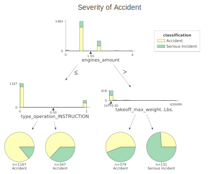

```{r}
knitr::opts_chunk$set(echo = TRUE)
pacman::p_load(tidyverse, pacman, ggmap, ggplot2, GGally, lubridate, raster,gganimate, fastDummies)

```


Decision Tree




The depth-2 tree achieves the best mean cross-validation accuracy 74.94988 +/- 1.62372% on training dataset.

Logistic Regression

```{r}
knitr::include_url("incident_raw_logistic_result.html", height = "500px")
```

For linearity, due to there are so many plots, we choose not to 


As shown, 


## Multicollinearity
```{r}
load("assumption.RData")
myvif
```
 
To satisfy collinearity assumption, we make sure all VIF value are less than 10. We manually removed the variables with VIFs greater than 10.


## Outliers
```{r}
plot(mylogit, which = 4, id.n = 3)
library(broom)
model.data <- augment(mylogit) %>% 
  mutate(index = 1:n()) 
model.data %>% top_n(3, .cooksd)
ggplot(model.data, aes(index, .std.resid)) + 
  geom_point(aes(color = classification), alpha = .5) +
  theme_bw()

model.data %>% 
  filter(abs(.std.resid) > 3)
```

To filter outliners, we try searching for the points with absolute value of standard residual to be greater than 3, we find no such points in our dataset hence there is no influential observations.


Due to a small R^2, we prefer decision tree over logistic regression. Moreover, we would like to perform unsupervised learning DBSCAN to cluster the data points. Before doing so, we need to use PCA to prevent the curse of dimensionality.


http://www.sthda.com/english/articles/36-classification-methods-essentials/148-logistic-regression-assumptions-and-diagnostics-in-r/
