<div style="text-align: justify">
<div style="text-justify: inter-word">

```{r setup, include=FALSE}
knitr::opts_chunk$set(echo = TRUE)
options(knitr.duplicate.label = "allow")
```

## Introduction

Modern society has been become increasingly dependent on the use of airplanes during the past decades. Despite the impressive engineering feat that aviation represents, airplanes and other aircraft sometimes fail, occasionally fatally. Understanding the causes of failure and considering what can be done to address these is of crucial interest for regulatory bodies and aviation authorities, but also for passengers. In the following dataset, we consider an extensive collection of incidents involving aircraft of different types across Brazil in the period of time 2006-2015. Various data have been collected for each incident. In what follows, we set out to investigate common features of these aircraft incidents.

### Research questions

The main goal of this project is to answer the following question: what are the main risk factors that led to a plane crash in Brazil from 2006 to 2015? Similarities between the accidents will be sought. Here are some more specific questions arising from the main problem that we will try to answer: 

- How are the accidents distributed on a map? Are there areas where accidents are more concentrated? 

- How do the accidents evolve through time? Is the occurrence rate constant? Are there periods with more accidents, i.e. during school vacation, summer? Do they happen at a certain time of the day?

- Does the age of the aircraft play a role? Are old planes more prone to accidents? 

- What are the main occurrence types or causes of accidents? 

- What about the characteristics of the aircraft? Do certain features of the aircraft have an influence on the occurrences?

- What are the causes of severe incidents?

### Approaches

To answer our question, we first represented the accidents by state in Brazil to visualize their distribution. To go further, we used $\textsf{R}$ packages for geocoding (data with only place names, but no geographic coordinates) to represent each accident on a map.  
We then turned to the temporal analysis. For this, we first made a visual approach and then an analytical one through a linear, logistic and quantile regression in order to study the association between the life of the aircraft, the severity of the accident and the level of damage.
In addition, we made pie charts to see the shares between each category of each characteristic. We also checked whether some columns were highly correlated with each other. To dig further, we made pie charts to see to understand the multiples causes of occurrences.
Finally, we wanted to find a good prediction of crash severity. To do this, the categorical data were transformed into numerical data by obtaining dummy variables and we performed a decision tree and logistic regression.

## Sources of information / datasets

The dataset used in this report is from  [Kaggle](https://www.kaggle.com/paulovasconcellos/aeronautics-accidents-in-brazil) provided by the CENIPA (Centro de Investigação e Prevenção de Acidentes aeronáuticos, [Brazilian Open Data](https://dados.gov.br/dataset/ocorrencias-aeronauticas-da-aviacao-civil-brasileira)). The given dataset contains two files (`aircrafts.csv` and `occurrences.csv`), but merging them based on the unique occurrence ID ($occurrence\_id$) for each aircraft was possible, so the latter one (`aircrafts_occurrences_merged.csv`) was used to analyse the different occurrences from the aircrafts. 

The file contains different information about the aircraft and the accident. First of all, the dataset contains several columns about the features of the aircrafts which encountered accidents:

* $aircraft\_id$ - Aircraft's identification number
* $registration$ - Aircraft's registration number
* $operator\_id$ - Operator's identification number
* $equipment$ - Type of aircraft (airplane, helicopter, glider, ultralight, amphibious, airship). Some of them are unknown.
* $manufacturer$ - Aircraft's manufacturer
* $model$ - Aircraft's model
* $engine\_type$ - Type of engine
* $engines\_amount$ - Amount of engines (it goes from 0 to 4)
* $takeoff\_max\_weight$ (Lbs) - Maximum takeoff weight (MTOW)
* $seatings\_amount$ - Quantity of seatings available
* $year\_manufacture$ - Aircraft's year of fabrication
* $registration\_country$ - Country where the aircraft was registered (mostly Brazil, but also some other neighbouring countries)
* $registration\_category$ - Aircraft's registration category at the moment of the occurrence
* $registration\_aviation$ - Aircraft's aviation category at the moment of the occurrence
* $origin\_flight$ - Location of the departure of the flight
* $destination\_flight$ - Planned destination of the flight
* $operation\_phase$ - Operation phase at the moment of the occurrence
* $type\_operation$ - Type of operation at the moment of the occurrence
* $damage\_level$ - Level of damage of the aircraft, there are four levels (none, light, substantial and destroyed). Some of them are unknown.
* $fatalities\_amount$ - Number of fatalities (deaths) occurred
* $extraction\_day$ - Date when the data was collected

Then, the dataset also contains columns about the occurrences: 

* $classification$ - Accident classification (serious incident or accident)
* $type\;of\;occurrence$ - Type of accident 
* $localization$ - City where the occurrence happened
* $fu$ - State where the occurrence happened
* $country$ - Country where the occurrence happened (mostly Brazil, but also some other neighbouring countries)
* $aerodrome$ - Aerodrome's ICAO code
* $occurrence\_day$ - Occurrence date
* $time$ - Time of the occurrence (UTC)
* $under\_investigation$ - If the accident is or went under investigation (yes, no or unknown)
* $investigating\_command$ - Investigation command responsible for the occurrence investigation
* $investigation\_status$ - Status of the investigation
* $report\_number$ - Final report's identification number
* $published\_report$ - If the report was published (if yes, 1)
* $publication\_day$ - Publication day of the report
* $recommendation\_amount$ - Security recommendation quantity emitted
* $aircrafts\_involved$ - Quantity of aircrafts involved in the occurrence
* $takeoff$ - If the aircraft took of (if yes, 1)
* $extraction\_day$ - Date when the data was collected


````{r packages, include=FALSE}
library(ggplot2)
library(geobr)
library(tidyr)
library(dplyr)
library(corrplot)
library(stargazer)
library(cowplot)
library(snakecase)
library(stringi)
library(stringr)
library(leaflet)
library(readr)
library(quantreg)
library(latex2exp)
library(lubridate)
library(knitr)
````

```{r,include=FALSE}
tex2markdown <- function(texstring) {
  writeLines(text = texstring,
             con = myfile <- tempfile(fileext = ".tex"))
  texfile <- pandoc(input = myfile, format = "html")
  cat(readLines(texfile), sep = "\n")
  unlink(c(myfile, texfile))}
```


## Exploratory data analysis
```{r, include=FALSE}
# loading the data
#data=read.csv("~/Desktop/Github/SCV/SCV_project/MATH517team2-4/MATH517team2-4/Data/aircrafts_occurrences_merged.csv")
data = read.csv("../Data/aircrafts_occurrences_merged.csv")
```

```{r,include=FALSE}
#dealing with the NA
data_na_count<-data
data_na_count <- subset( data_na_count, select = -c("occurrence_day", "publication_day"  ) )
data_na_count[data_na_count == "****"] <- NA
na_count <-sapply(data_na_count, function(y) sum(length(which(is.na(y)))))
na_count
```

```{r,include=FALSE}
data_wo_na=drop_na(data)
```

```{r ,  results='asis', echo=FALSE}
stargazer(na_count, flip=TRUE, type = "html", title = "Table 1: Repartition of NAs in the columns")
```

The dataset contains variables with numerous missing values. Normally, we will not need them. Table 1 displays the number of missing values in each column. $Takeoff$ is the top column containing NAs, with more than 87.4% of the data missing. We see also a significant number of missing data points in the column $fatalaties\_amount$  with 82.6% and the columns related to the report such as $report\_number$ with more than 78.6%, $published\_report$ with 51%. We can see that the data is most present for columns containing information that are independent of the accident such as $aircraft\_id$, $manufacturer$ and $type\_operation$.

```{r, include=FALSE}
table(data["equipment"])/(2043-1)
```

When looking at the type of equipment, 78% of our data concerns airplanes. It is followed by helicopters that constitute a little less that 13% of the data. Then comes ultralights, a bit more than 7% of the dataset. The rest are airships, amphibious or unknown.

```{r, include=FALSE}
unique(data["manufacturer"])
```
```{r, include=FALSE}
table(data["manufacturer"])
```

There are 120 unique manufacturers represented in our dataset. The top three manufacturers are the following: Indústria Aeronáutica Neiva, Embraer and Aero Boero with respectively 388, 155 and 126 planes.

```{r, include=FALSE}
table(data$engine_type)/2043
```

78% of the aircrafts present in the dataset are motorized with a piston engine, 7% with a turboshaft engine, 6.8% with turboprop and the rest with jet, without traction or unknown engines.

```{r NbrEng, fig.cap="Distribution of the number of engines",echo=FALSE}
hist(data$engines_amount,main="Distribution of the number of engines", xlab="Number of engines")

```

```{r,include=FALSE}
table(data$engines_amount)/(2043-9)
```

Considering Figure \@ref(fig:NbrEng), 73.25% of the aircrafts have a single engine. 24% are twin-engine. The rest are equipped with either 3 or 4 engines. We believe that 0 refers to unknown data although there was no mentions of it in the data description. It could also be the value taken for a glider.

```{r distWeight,fig.cap="Distribution of take off max weight (in Lbs)", echo=FALSE}
data_weight_no_zero=data
data_weight_no_zero=data_weight_no_zero[data_weight_no_zero$takeoff_max_weight..Lbs. != 0,]
hist(data_weight_no_zero$takeoff_max_weight..Lbs., main="Distribution of take off max weight (in Lbs)", xlab='Lbs', breaks =50)
```
```{r,include=FALSE}
max(data_weight_no_zero$takeoff_max_weight..Lbs.)
```

Figure \@ref(fig:distWeight) shows the distribution of takeoff max weight (in Lbs). It can be seen that that the mean weight is of 11,919.2 Lbs (5406.4 Kg). There are though very strong outliers with aircrafts having set their maximum weight at 630,499 Lbs (285,989.5 Kg).

```{r distManYear,fig.cap="Distribution of manufacturing year",echo=FALSE}
data_year_no_zero=data
data_year_no_zero=data_year_no_zero[data_year_no_zero$year_manufacture != 0,]
hist(data_year_no_zero$year_manufacture,breaks=100, main="Distribution of manufacturing year", xlab="Year")
```

In Figure \@ref(fig:distManYear) is displayed the distribution of manufacturing year. One can observe that the aicrafts represented in the dataset were manufactured between 1936 and 2015. The year distribution is trimodal with high peaks in late 70s, early 90s and mid 00s.

```{r, include= FALSE}
table(data$registration_country)
```

Concerning the registration country, 2000 out of the 2043 constituting the data are registered in Brazil. 22 are registered in the United States of America and finally there is one accident registered in Germany, France, Poland, Russia, Saudi Arabia, South Africa, Spain and Uruguay.

```{r, include= FALSE}
table(data$registration_aviation)/(2043)
```

37% of the accidents concern $private$ registrations. 18% come from $instruction$ registration. The rest are either $aerotaxi$ (13%), $experimental$ (9.8%), $agricultural$ (9%), $regular$ (4%), $specialized$ (3%) or other registrations.

```{r, include= FALSE}
sort(table(data$operation_phase)/2043)
```

19% of the accidents registered happened during landing, 17% during takeoff, 11% during cruise and 9% during the run after landing. Accidents also happen during the following phases: during maneuver (4.9%), ascension (4.8%), final approximation (3.4%), descend (3.3%), low altitude navigation (2.8%), traffic circuit (2.5%), taxi (2%), rush on the ground (1.4%) and other less represented phases.

```{r, include= FALSE}
sort(table(data$damage_level)/2043)
```
```{r, include= FALSE}
table(data$classification)/2043
```

Concerning the damage, 72.6% of crashes were classified as $accident$ and the rest was classified as $serious$ $incident$. 58% of the aircrafts knew substantial damage after the crash. 17% are completely destroyed, 12.7% know light damage where 8% have no damage. The rest is unknown.

```{r distFat,fig.cap="Distribution of fatalities",echo=FALSE}
hist(data$fatalities_amount, breaks=50, main= "Distribution of fatalities", xlab="fatalities")
```

In Figure \@ref(fig:distFat) is displayed the number of fatalities. It can be seen that most of the crashes involve less than 20 deaths. The deadliest crash happened to regularly scheduled domestic passenger flight from Porto Alegre São Paulo in 1999 where 199 lost their life during landing. The Airbus A320-233 executing the flight overran runway 35L at São Paulo during moderate rain and crashed into a nearby TAM Express warehouse adjacent to a Shell filling station. The plane exploded on impact, killing all 187 passengers and crew and 12 people on the ground [@deadlycrash].

```{r, include=FALSE}
table(data$investigation_status)/2043
```

Finally, the investigation of 52% of the crashes is finished. 37% are in progress while less than 0.05% of the crashes have had their investigation reopened.

## Geographical visualization of accidents

```{r, include=FALSE}

data = read.csv("../Data/aircrafts_occurrences_merged.csv")

# Select needed variables
data = data[, c("localization", "fu", "country", "aerodrome", "origin_flight",
                "destination_flight", "registration_country", "classification",
                "registration", "manufacturer", "model", "operation_phase",
                "damage_level", "type.of.occurrence", "occurrence_day", "time")]

# Formatting
data$classification = tolower(data$classification)
data$manufacturer[data$manufacturer == "***"] = "unknown"
data$model[data$model == "***"] = "unknown"
data$operation_phase = tolower(data$operation_phase)
data$operation_phase[data$operation_phase == ""]  = "unknown"
data$damage_level = tolower(data$damage_level)
data$type.of.occurrence = tolower(data$type.of.occurrence)


#### Accidents per state ####

# Brazil states
brazil_fu = data[data$fu != "***" & data$fu != "EX",]

# Accidents per state
brazil_fu = data.frame(table(brazil_fu$fu))
colnames(brazil_fu) = c("fu", "accidents")

# Brazilian states
#states <- read_state(year=2019)
states <- readRDS("states.rds")

# Join the databases
states <- dplyr::left_join(states, brazil_fu, by = c("abbrev_state" = "fu"))
states$accidents[is.na(states$accidents)] = 0

# Map
labels <- sprintf(
  "<strong>%s</strong><br/>%g accidents",
  states$name_state, states$accidents
) %>% lapply(htmltools::HTML)

bins <- seq(0,500,100)
pal <- colorBin("YlOrRd", domain = states$accidents, bins = bins)

fu <- leaflet(states) %>% addTiles() %>% addPolygons(
  fillColor = ~pal(accidents),
  weight = 1,
  opacity = 1,
  color = "grey",
  dashArray = "3",
  fillOpacity = 0.4,
  layerId = ~geom,
  highlightOptions = highlightOptions(
    weight = 3,
    color = "#666",
    dashArray = "",
    fillOpacity = 0.6,
    bringToFront = TRUE),
  label = labels,
  labelOptions = labelOptions(
    style = list("font-weight" = "normal", padding = "3px 8px"),
    textsize = "15px",
    direction = "auto")) %>%
  addLegend(pal = pal, values = ~accidents, opacity = 0.7, title = "Accidents",
            position = "bottomright")

# External accidents + NAs
external = t(data.frame(table(data[data$fu == "***" | data$fu == "EX", "country"])))
rownames(external) = c("Countries", "Accidents")
#stargazer(external)

# Preparing data before geolocating
brazil = data[data$fu != "***" & data$fu != "EX" & data$localization != "NÃO IDENTIFICADA",]

# Loading coordinates
table = readRDS(file = "localization.rds")

# Adding location
brazil$localization = to_title_case(brazil$localization)
n = length(brazil$localization)
loc = 0

for (i in 1:n) {
  loc = rbind(loc, table[table$names==brazil$localization[i], c("lon", "lat")])
}

brazil = cbind(brazil, loc[-1,])

# Label + popup
label <- sprintf("%s<br/>%s<br/>%s<br/>%s",
                  brazil$model,
                  brazil$classification,
                  brazil$occurrence_day,
                  brazil$localization
                  ) %>% lapply(htmltools::HTML)

popup <- paste(sep = "<br/>",
               paste("Model:", brazil$model),
               paste("Manufacturer:", brazil$manufacturer),
               paste("Registration:", brazil$registration),
               paste("Classification:", brazil$classification),
               paste("Damage level:", brazil$damage_level),
               paste("Operation phase:", brazil$operation_phase),
               paste("Type of occurrence:", brazil$type.of.occurrence),
               paste("Occurrence date:", brazil$occurrence_day),
               paste("Occurrence time:", brazil$time)
               )

# Map
cluster <- leaflet(data = brazil) %>% addTiles() %>%
  addMarkers(~lon, ~lat, popup = popup, label = label, clusterOptions = markerClusterOptions())

# Cities with most accidents
cities = t(data.frame(sort(table(brazil$localization), decreasing = TRUE)[1:10]))
rownames(cities) = c("Cities", "Accidents")
#stargazer(cities)

```

This section is devoted to the study of the places where aircraft accidents occur. Indeed, it is essential to understand this in order to identify more risk factors.

First, a comparison between the Brazilian states allows us to draw a first conclusion (Figure \@ref(fig:states)). Note that accidents are cumulative over the 10-year period.

```{r states, fig.cap="Number of accidents from 2006 to 2015 by state in Brazil", echo=FALSE}

fu

```

All the states have less than 200 accidents, more precisely less than 170 (Rio Grande do Sul), except one: São Paulo. This state is not larger than the others (it is rather medium in size), which indicates that there is clearly a concentration of accidents in this area. Note that ten accidents are not shown on the map (Table 2). Eight of them occurred outside of Brazil and two more for other reasons: one ended up in international waters and the other does not have its location identified.

```{r , results='asis', echo=FALSE}

stargazer(external, type = "html", title = "Table 2: Accidents not reprensented on the previous map by country")

```

An explanation for this observation is linked in particular to demography. Indeed, the state of São Paulo is the most populous in Brazil with more than 41 million inhabitants in 2010 [@population]. This represents more than 20% of the total population of the country. Air traffic is therefore concentrated there, especially since the largest airports of the country are located in this state (for example São Paulo Guarulhos International Airport and São Paulo Congonhas Airport). The risk of accidents is therefore higher.

To be more precise in the geographical approach, it is possible to establish a map according to the location of the accident (nearest city). As the geographic coordinates are not included in the data, it is possible to use geocoding given that the city is available. For this, we used two packages: `ggmap` and `Nominatim`. An API key is required to geocode for each package ([Google Maps](https://mapsplatform.google.com) for `ggmap` and [MapQuest](https://developer.mapquest.com) for `Nominatim`). As the locations are quite precise, there are often errors in the coordinates returned by geocoding, which is why we used two packages by selecting the most reasonable coordinates. It is still possible to have some deviations between the city and the place shown on the map, but the latter should not be greater than a degree of longitude and latitude.

In Figure \@ref(fig:location), accidents are represented in clusters which are scattered by zooming. For each accident, information is available such as the model, the manufacturer, the date or the time. Note that 11 more accidents have been removed compared to the last map. The reason is that the location has not been identified.

```{r location, fig.cap="Number of accidents from 2006 to 2015 clustered by location in Brazil", echo=FALSE}

cluster

```

We still notice the same thing, that is to say a concentration of accidents in the Southeast Region of Brazil. This is explained by the fact that the traffic there is the most dense, as this article confirms in particular [@airtraffic]. It turns out that some cities are noteworthy in terms of the number of accidents. Table 3 represents the ten cities with the most accidents.

```{r, results='asis', echo=FALSE}

stargazer(cities, type = "html", title = "Table 3: Top ten cities with the highest number of accidents")

```

A demographic explanation is still reasonable. The first six cities in Table 3 are among the ten most populous cities in Brazil [@cities]. Moreover, they also have airports on the list of the 20 busiest airports in Brazil [@airports].

Looking more closely at the accidents in these cities, we see that all kinds of aircraft are represented, whether they are airliners, tourist planes or even helicopters. To learn more in this direction, it is possible to further explore the accidents on the map (Figure \@ref(fig:location)).


## Time analysis

### Visualization
```{r, include=FALSE}
data = read_csv("../Data/aircrafts_occurrences_merged.csv")

data$occuranceWeek <- as.Date(data$occurrence_day)
data$occuranceWeek <-wday(data$occuranceWeek, label=TRUE)

data$publicationWeek <- as.Date(data$publication_day)
data$publicationWeek <-wday(data$publicationWeek, label=TRUE)
```

```{r, include=FALSE}
data$occuranceWeek <- as.Date(data$occurrence_day)
```

```{r hourAccid, fig.cap="Distribution of accidents throughout the hours of the day", echo=FALSE}
hist(strptime(data$time, format="%H:%M:%S"),main="Distribution of accidents throughout the hours of the day",xlab="Hours of the day",breaks="hours")
```

In Figure \@ref(fig:hourAccid) are displayed the distribution of accidents throughout the hours of the day. The distribution is bimodal and it can be observed that most of the crashes happen either at 2pm or at 8pm.

```{r timeAccid, fig.cap="Distribution of accidents throughout days",  echo=FALSE}
hist(data$occurrence_day,main="Distribution of accidents throughout days",xlab="Days",breaks='months')
```

 
Figure \@ref(fig:timeAccid) shows the distribution of accidents over time. We can see an increasing trend, which may be due to the growth of the air transport market and the development of aircraft. We can also observe a seasonal trend in the graph, which may be due to the fact that there are usually more flights during the summer. 

```{r, include=FALSE}
Time_Occurence_publication=data$publication_day-data$occurrence_day
Time_Occurence_publication=as.numeric(Time_Occurence_publication, units="days")
```

```{r Occurancepublication, fig.cap="Distribution of time difference between the occurrence and the publication date",echo=FALSE}
hist(Time_Occurence_publication,main="Distribution of time difference: occurrence and publication",xlab="Number of days")
```

In Figure \@ref(fig:Occurancepublication) is displayed the distribution of time difference in days between the occurrence day and publication day. It can be seen that most of crashes are reported the same year. The longest time difference is of 3589 days. It was for a political operation caused by a loss of control in the air in year 1986 in Brazil.

### Lifetime of aircraft

```{r include=FALSE}
df.age <- read_csv("../Data/aircrafts_occurrences_merged.csv")
```

In this section, we consider whether there is any association between the age of an aircraft and the severity and damage level of the incident. To begin, we have plotted the cumulative distribution function of the aircrafts' age in Figure \@ref(fig:ageCDF) below.

```{r echo=FALSE}
# Setting categorical variables to factors and removing missing values

# Removing rows with missing or 0 value for the year of manufacture
df.age<-df.age[df.age$year_manufacture!=0 & !is.na(df.age$year_manufacture),]

# Extracting the year of occurrence
df.age$occurrence_day<-as.numeric(format(df.age$occurrence_day, format="%Y"))

df.age$lifetime<-df.age$occurrence_day-df.age$year_manufacture


# Plotting cumulative distribution functions
# plot(ecdf(df.age$occurrence_day))
# plot(ecdf(df.age$year_manufacture))


# First, we assign a numerical value to each damage level, and remove rows with unknown damage level

df.damage.age<-df.age[df.age$damage_level!='UNKNOWN',]
df.damage.age$damage_level[df.damage.age$damage_level=='NONE']<-0
df.damage.age$damage_level[df.damage.age$damage_level=='LIGHT']<-1
df.damage.age$damage_level[df.damage.age$damage_level=='SUBSTANTIAL']<-2
df.damage.age$damage_level[df.damage.age$damage_level=='DESTROYED']<-3
df.damage.age$damage_level<-as.numeric(df.damage.age$damage_level)

# Assign values 0 to incidents classified as 'accident', and 1 to incidents classified as serious incident
df.damage.age$classification[df.damage.age$classification=='ACCIDENT']<-0
df.damage.age$classification[df.damage.age$classification=="SERIOUS INCIDENT"]<-1
df.damage.age$classification<-as.numeric(df.damage.age$classification)

# Set aircraft type as factor, and remove NA rows
df.damage.age$equipment<-as.factor(df.damage.age$equipment)
df.damage.age<-df.damage.age[!is.na(df.damage.age$equipment),]
```

```{r ageCDF, fig.cap="Cumulative distribution function of the aircraft's lifetime, denoted by $X$", echo=FALSE}
plot( ecdf(df.age$lifetime), main='', ylab =TeX('$P(X \\leq x)$') )
```

We observe that more than 80% of the aircrafts are between 0 and 40 years old at the time of the incident, with a small number of aircrafts reaching nearly 80 years.

Next, we provide a scatter plot to visually inspect the association between age and damage level in (\@ref(fig:damagelifetime))

```{r damagelifetime, fig.cap="Scatter plot of damage level (coded on a 0-3 scale) versus aircraft lifetime in recorded incidents", echo=FALSE}
plot(df.damage.age$lifetime, df.damage.age$damage_level, 'p', xlab='Aircraft lifetime',ylab='Damage level')
```

and likewise between aircraft lifetime and accident severity (outcome)  in (\@ref(fig:damageseverity)).

```{r damageseverity, fig.cap="Scatter plot of severity versus aircraft lifetime in recorded incidents", echo=FALSE}
plot(df.damage.age$lifetime, df.damage.age$classification, 'p', xlab='Aircraft lifetime', ylab='accident severity')
```

To investigate the marginal association between age and damage level we perform regression analysis using a linear model, logistic model in addition to quantile regression.

The fit diagnostic for the linear regression of damage level on lifetime of the plane gives

```{r echo=FALSE}
fit.linear<-lm(df.damage.age$damage_level ~ df.damage.age$lifetime)
summary(fit.linear)
```

Here, we have coded the damage level on a scale of 0 to 3. Furthermore, the confidence interval is given by

```{r echo=FALSE}
cbind(beta = coef(fit.linear), confint(fit.linear))
```

which is small and includes the null value of the slope.

Likewise, the logistic regression of aircraft lifetime on severity (with corresponding confidence intervals) is given below:

```{r echo=FALSE}
fit.logistic <-glm(classification ~ lifetime, data = df.damage.age, family = "binomial")
summary(fit.logistic)
exp(coef(fit.logistic))
exp(cbind(OR = coef(fit.logistic), confint(fit.logistic)))
```

Once again, the confidence interval includes the null value. Finally, we consider the quantile regression coefficient from the quantile regression model
$$ Q_Y(\tau\mid X) = a_0(\tau) + b_0(\tau)X $$
where the outcome $Y$ is airplane lifetime and we take accident severity as an exposure $X$. The resulting regression coefficient is plotted in Figure \@ref(fig:quantilelifetime).

```{r quantilelifetime, fig.cap="Quantile regression of damage level on the quantile of aircraft lifetime", echo=FALSE}
# Quantile regression for severity
fm2 <- rq(lifetime ~ classification, data = df.damage.age, tau =  0.1+ 1:8/10)
plot(fm2, parm = 2, mar = c(5.1, 4.1, 2.1, 2.1), xlab=TeX('$\\tau$'),main='Y = Lifetime, X = Damage level', ylab = TeX('$b_0(\\tau$)'), cex = 1, pch = 19)
```

The quantile plot shows that the conditional cumulative distribution function, conditioning on severity level "serious incident", is narrower compared to the conditional cumulative distribution function, conditioning on severity level "accident". In other words, both high and low quantiles are shifted towards the median.

As we did not find any strong associations between damage level and age of the aircraft marginally in the population, it motivated us to examine further whether such associations could exist within subsets of the population, such as the strata of incidents involving helicopters. Once again, we perform a logistic regression, which yields the following fit diagnostic and confidence intervals:

```{r echo=FALSE}
df.helicopters<-df.damage.age[df.equipment='HELICOPTER',]
fit.logistic <-glm(classification ~ lifetime, data = df.helicopters, family = "binomial")
summary(fit.logistic)
exp(coef(fit.logistic))
exp(cbind(OR = coef(fit.logistic), confint(fit.logistic)))
```

We do not find a strong association between accident severity and aircraft age within the stratum of helicopters either (the confidence interval for the lifetime coefficient includes the null-value, and the p-value of the coefficient is 0.227).

## Features of the aircrafts

Different features of aircrafts are presented in the dataset, and some types of them might have caused the most accidents among all. An interactive plot ([link](https://aircraftaccteam2.herokuapp.com)) involving pie charts of the number of counts of different features is made to compare and determine which types of features have the most occurrences. Here are the output for variables $equipment$, $manufacturer$, $model$, $engine\_type$, $engines\_amount$, $registration\_aviation$, $operation\_phase$, $type\_operation$.

```{r equip, fig.cap="The shares of accidents coming from the same type of aircraft", echo=FALSE}

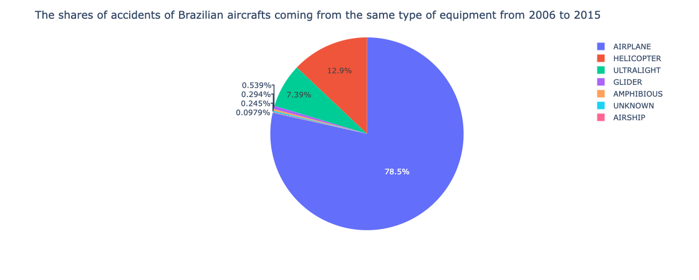

```

```{r manu, fig.cap="The shares of accidents coming from the same manufacturer", echo=FALSE}

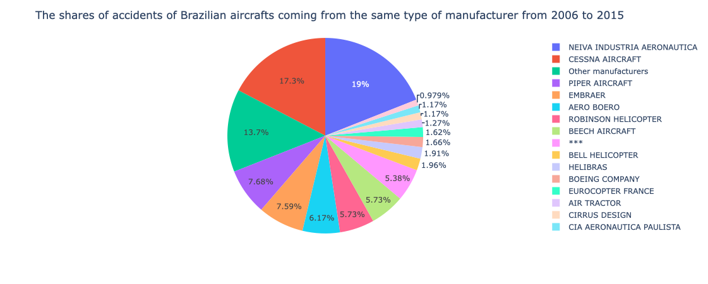

```

```{r model, fig.cap="The shares of accidents coming from the same aircraft model", echo=FALSE}

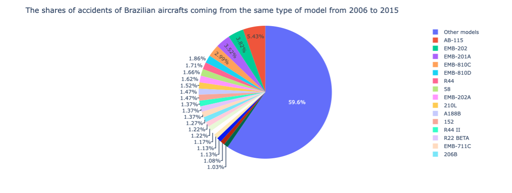

```

```{r engtyp, fig.cap="The shares of accidents coming from the same type of aircraft engine", echo=FALSE}

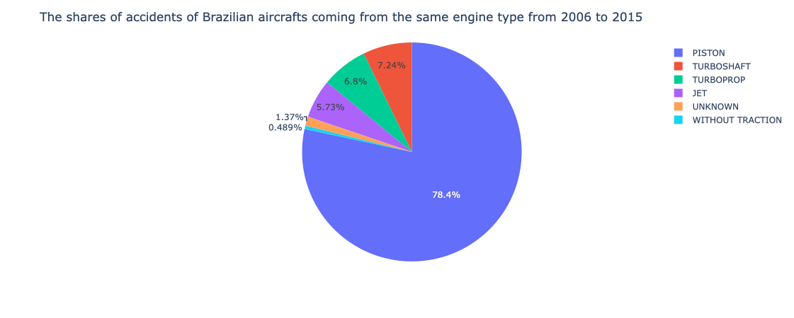

```

```{r engamo, fig.cap="The shares of accidents coming from the same amount of engine", echo=FALSE}

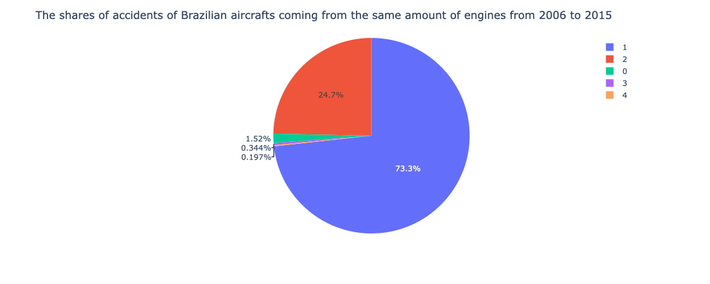

```

```{r regav, fig.cap="The shares of accidents coming from the same registration of aviation ", echo=FALSE}

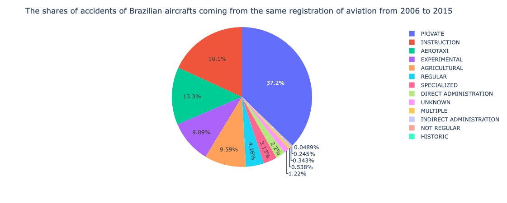

```

```{r opphase, fig.cap="The shares of accidents coming from the same operation phase", echo=FALSE}

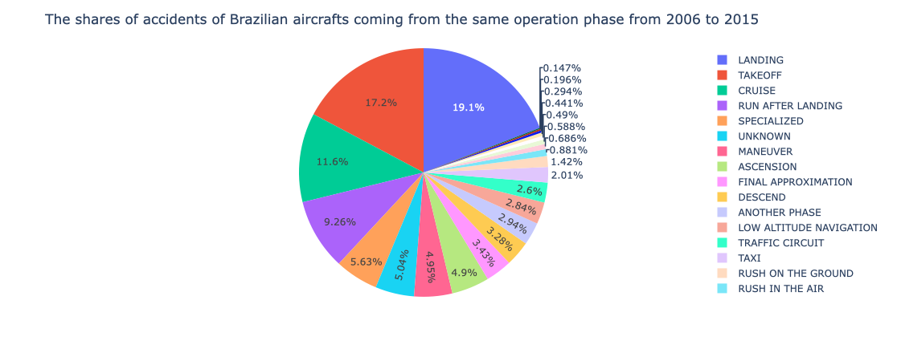

```

```{r typop, fig.cap="The shares of accidents coming from the same type of operation", echo=FALSE}

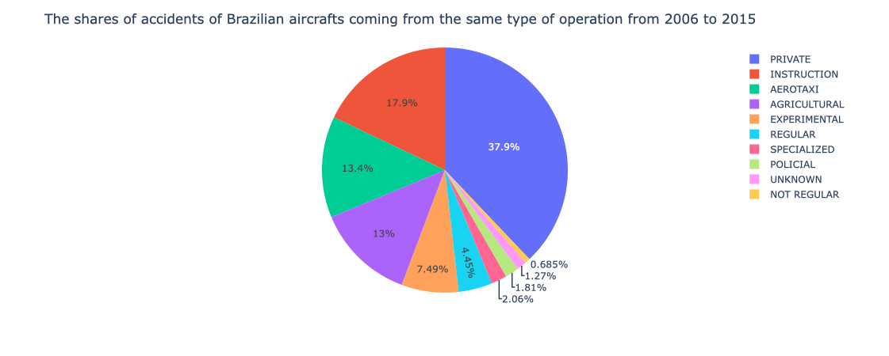

```

Figure \@ref(fig:equip) to Figure \@ref(fig:typop) are the pie charts of the shares of different features of the aircrafts. First, certain features have a dominating one, such as the one for the type of aircraft from Figure \@ref(fig:equip) (airplane), the one for the type of engine from Figure \@ref(fig:engtyp) (piston), and the one for the amount of engine from Figure \@ref(fig:engamo) (1). Then there are also certain features that are more shared by different categories, but the main one is still apparent, such as the one for the aviation registration from Figure \@ref(fig:regav) (Private) and the one for the type of operation from Figure \@ref(fig:typop) (private). Last, some are shared by several categories, such as the one for the operation phase from Figure \@ref(fig:opphase) having landing and takeoff as the type phases in which the accidents occurred the most. The one for the manufacturer and the model (Figure \@ref(fig:manu) and Figure \@ref(fig:model)) are shared by multiple types of them, but we can observe that the share of the manufacturers are spread more or less equally for only certain of them, whereas the one of the model is shared more or less equally for almost all of them. We have a more dense share for the model: if we except the ones that have less than 20 counts, the amount would sum up to almost 60\%.

Although there are certain types of aircraft features that encountered the most accidents, we cannot say much if they are more likely to encounter accidents than others, since we do not know the percentage among all the flights. It is highly possible that the main ones are also the most used ones, and the percentage of occurrences might not be bigger than the other ones. Therefore it is hard to conclude that the choice of certain features can be more dangerous to the passengers or not. We can still say that the most dangerous operation phase is when the aircraft is landing or taking off, since all the aircrafts go through all the phases during the operation.

The correlation between the different features is interesting to observe, since we can omit certain columns to analyse the type of the features of aircrafts that encountered the most accidents. However there are some subtle ties in analysing the correlation because the variables are categorical. As most of the variables are not ordered, several columns suspected to be correlated are chosen.

The aim is to see if between the two chosen columns, one is a further classification of the other one. For instance, we want to check if aircrafts of the same model are from the same manufacturer. In other words, we want to check if the column $model$ is a further classification of the column $manufacturer$. Mainly, we want to check if the aircraft models have a certain type of fixed features, because if they are, those features can be omitted and the information about the model is enough for the analysis.

To check, let A and B the columns. Then the count of categories of A is counted for each categories of B, and the sum of the number of outliers (all counts except the largest count from A) is computed. We made several hypotheses and checked if they were correct:

* Are the aircrafts from the same model belonging to the same type of aircraft?
* Do the aircrafts from the same model come from the same manufacturers?
* Do the aircrafts from the same model have the same maximum weight for the takeoff?
* Do the aircrafts from the same model have the same number of available seatings?
* Do the aircrafts from the same model have the same number of engines?
* Do the aircrafts from the same model have the same type of engines?
* Do the aircrafts from the same model registered for the same purpose?


```{r , results='asis', echo=FALSE}
A=c("equipment", "manufacturer","takeoff max weight (Lbs)", "seatings amount", "engines amount", "engine type","registration aviation")
B=c("model","model","model","model","model","model","model")
Number_of_outliers=c(7,92,173,211,5,8,392)
corr=t(data.frame(A,B,Number_of_outliers))

stargazer(corr, type = "html", title = "Table 4: the pair of columns chosen and its number of outliers")

```

Table 4 shows the number of outliers computed from each pairs of columns. We can observe that on one hand, there are several columns that are indeed highly correlated to the model, such as the type of aircraft, the amount of engines and the type of engines. On the other hand, there are columns that do not often match with the one of the model: the $registration\_aviation$ has the most outliers among all. We can conclude that although some columns can be omitted, the others are still important to consider. For instance, for $registration\_aviation$, almost 20\% of the cases are outliers, for $takeoff\_max\_weight$ (Lbs) and $seatings\_amount$ about 10\% are outliers, and for $manufacturer$ about 5\% are outliers. We can see that quite often the aircrafts users changed some features from the original aircraft model.

The maximum weight for the takeoff and the number of available seats of the aircrafts have also been used for the analysis. The scatter plots are made for the analysis, since we are working with categorical variables that are ordered.

```{r max, fig.cap="The shares of accidents coming from the same type of operation", echo=FALSE}

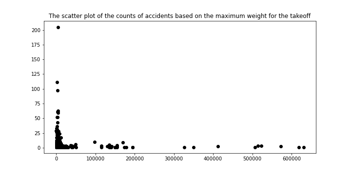

```

Figure \@ref(fig:max) is a scatter plot of the count of the accidents of each maximum weights. We can observe that most of the accidents are from aircrafts having lower maximum weights.

```{r seat, fig.cap="The shares of accidents coming from the same type of operation", echo=FALSE}

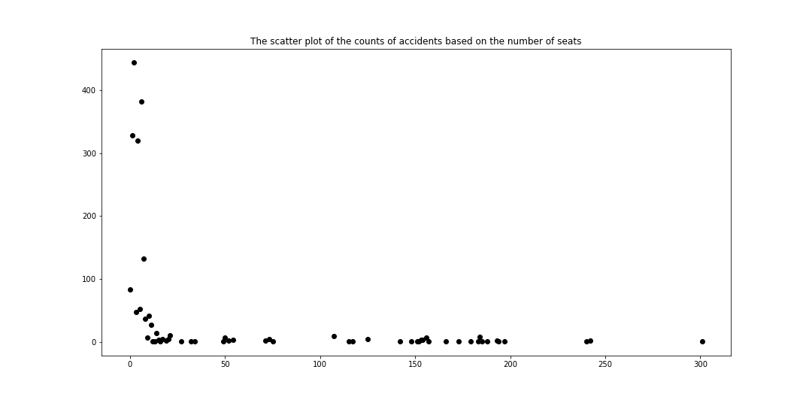

```

Figure \@ref(fig:seat) is a scatter plot of the count of the accidents of each number of available seatings. Again, we can observe that most of the accidents are from the aircrafts having the least number of available seatings.

As a result, we cannot conclude on the possibility of occurrences on the features of the aircraft, but the observation made shows that most of the occurrences come from private (Figure \@ref(fig:regav) and \@ref(fig:typop)) and small (Figure \@ref(fig:max) and Figure \@ref(fig:seat)) aircrafts.

### Type of occurrences : 


```{r , include = FALSE}
data <- read.csv("../Data/aircrafts_occurrences_merged.csv")
names(data)
dim(data)
```

:

```{r ,fig.cap ="Distribution of the type of occurrences",echo=FALSE}
#pie(data$type.of.occurrence)
barplot(table(data$type.of.occurrence))
```


As you can see, there are a many causes of an accident to occur and working with these causes will be difficult. One idea is to divide the causes into different categories. We choose to divide into causes that occurs on the take off of the plane, during the flight, during the landing, in the ground and finally the causes that can occur in any time, that we denote unknown. 


```{r, fig.cap = "Categorisation of the multiple type of occurrences",echo=FALSE}
takeoff <- c("TIRE BURST","LOAD LAUNCH","LEAVING THE TRACK")
during<- c("COLLISION AGAINST OBSTACLE DURING THE FLIGHT","ENGINE FAILURE DURING THE FLIGHT", "LOSS OF CONTROL IN THE AIR",
         "FIRE DURING THE FLIGHT","METEOROLOGICAL PHENOMENOM IN THE AIR","AIR TRAFFIC","LOSS OF COMPONENT DURING THE FLIGHT",
         "COLLISION AGAINST BIRD","ABOUT PASSENGERS/CREW DURING THE FLIGHT","AIRCRAFTS COLLISION IN THE AIR","SPATIAL UNAWARENESS",
         "FLIGHT COMMANDS","COLLISION DURING THE FLIGHT AGAINST TOWED OBJECT","AIRCRAFT HIT BY OBJECT")
landing <-c("ABOUT LANDING GEAR","LANDING ON UNPREDICTABLE PLACE","EXPLOSIVE / NOT INTENTIONAL DECOMPRESSION","HARD LANDING","SLOW LANDING",
           "LANDING WITHOUT LANDING GEAR" ,"LANDING BEFORE THE TRACK AREA")
ground <-c("METEOROLOGICAL PHENOMENOM ON THE GROUND","COLLISION AGAINST OBSTACLE ON THE GROUND","LOSS OF CONTROL ON THE GROUND",
           "FIRE ON THE GROUND","COMPONENT LOSS ON THE GROUND","ENGINE FAILURE IN THE GROUND","VEHICLE COLLISION AGAINST AIRCRAFT",
           "TERRAIN COLLISION")
unknown<- c("ABOUT ROTOR","FOD - DAMAGE CAUSED BY UNKNOWN OBJECT","SMOKE IN THE CABIN","LOW ALTITUDE MANEUVERS" ,"STRUCTURAL FAILURE",
                "UNKNOWN","SYSTEM / COMPONENT FAILURE","ANOTHER TYPES","INVOLUNTARY ENGINE CUT OFF","ABOUT PROPELLER","FLUID LEAKS",
                "FUEL STARVATION","PHYSIOLOGICAL PROBLEMS","TRACK INCURSION","ABOUT WINDOWS / DOORS / WINDSHIELD")

data_takeoff <- data[data$type.of.occurrence %in% takeoff,]
data_during <- data[data$type.of.occurrence %in% during,]
data_landing <- data[data$type.of.occurrence %in% landing,]
data_ground <- data[data$type.of.occurrence %in% ground,]
data_unknown <- data[data$type.of.occurrence %in% unknown,]

incident <- c("take off", "during the flight", "landing", "on the ground", "unknown")
dimension<- c(nrow(data_takeoff),nrow(data_during),nrow(data_landing),nrow(data_ground),nrow(data_unknown)) 
proportions <- data.frame(incident, dimension)
pie(proportions$dimension, labels = proportions$incident)
```


As you can see, most of the occurrences occurs during the flight. Surprisingly, there are a lot of occurences that occurs on the ground and a negligeable amount that occurs during the take off. 
Now we will study the severity of the accident depending on the causes. To do so we have two columns that we focus on : the classification of the accident if it was an incident or a serious accident and the damage level on the plane. 
First, let's see how the classification can vary depending on the type of occurrences. An accident is an occurrence where the flight has been stopped, a serious incident is an incident that involved circumstances that indicate a high probability of an accident. 


```{r ,fig.cap = "Proportion of the classifcation depending on the type of occurrences  ", echo=FALSE}
par(mfrow=c(2,3))
nb_accident = nrow (data_takeoff[data_takeoff$classification == "ACCIDENT",])
nb_serious = nrow (data_takeoff[data_takeoff$classification=="SERIOUS INCIDENT",])
takeoffserverity = data.frame (c(nb_accident,nb_serious), c("ACCIDENT", "SERIOUS INCIDENT"))
label = c (nb_accident/(nb_accident+nb_serious)*100, nb_serious/(nb_accident+nb_serious)*100)
pie (takeoffserverity$c.nb_accident..nb_serious., labels = paste(round (label), "%", sep = ""), main = "Take off")

nb_accident = nrow (data_during[data_during$classification == "ACCIDENT",])
nb_serious = nrow (data_during[data_during$classification=="SERIOUS INCIDENT",])
takeoffserverity = data.frame (c(nb_accident,nb_serious), c("ACCIDENT", "SERIOUS INCIDENT"))
label = c (nb_accident/(nb_accident+nb_serious)*100, nb_serious/(nb_accident+nb_serious)*100)
pie (takeoffserverity$c.nb_accident..nb_serious., labels = paste(round(label), "%", sep = ""),  main = "During the flight")

nb_accident = nrow (data_landing[data_landing$classification == "ACCIDENT",])
nb_serious = nrow (data_landing[data_landing$classification=="SERIOUS INCIDENT",])
takeoffserverity = data.frame (c(nb_accident,nb_serious), c("ACCIDENT", "SERIOUS INCIDENT"))
label = c (nb_accident/(nb_accident+nb_serious)*100, nb_serious/(nb_accident+nb_serious)*100)
pie (takeoffserverity$c.nb_accident..nb_serious., labels = paste(round(label), "%", sep = ""), main = "Landing" )

nb_accident = nrow (data_ground[data_ground$classification == "ACCIDENT",])
nb_serious = nrow (data_ground[data_ground$classification=="SERIOUS INCIDENT",])
takeoffserverity = data.frame (c(nb_accident,nb_serious), c("ACCIDENT", "SERIOUS INCIDENT"))
label = c (nb_accident/(nb_accident+nb_serious)*100, nb_serious/(nb_accident+nb_serious)*100)
pie (takeoffserverity$c.nb_accident..nb_serious., labels = paste(round(label), "%", sep = ""), main = "On the ground")

nb_accident = nrow (data_unknown[data_unknown$classification == "ACCIDENT",])
nb_serious = nrow (data_unknown[data_unknown$classification=="SERIOUS INCIDENT",])
takeoffserverity = data.frame (c(nb_accident,nb_serious), c("ACCIDENT", "SERIOUS INCIDENT"))
label = c (nb_accident/(nb_accident+nb_serious)*100, nb_serious/(nb_accident+nb_serious)*100)
pie (takeoffserverity$c.nb_accident..nb_serious., labels = paste(round(label), "%", sep = ""), main = "Any time during the flight")
pie (c(1,0))
legend("right", legend = c("Accident", "Serious Incident"), fill = c("white", "cadetblue3"),title = "Classification", cex = 1.5)
```


In most cases, most of the occurrences that happens are accidents. For the occurrences that happens during the landing, there are at 53% serious incident. To summarize we are going to plot the proportions of occurrences for each classification. 


comment...
```{r ,fig.cap = "Proportion of types of occurences for each classifcation ", echo=FALSE}

par(mfrow=c(1,2))
data_accident = data[data$classification == "ACCIDENT",]
data_serious = data[data$classification == "SERIOUS INCIDENT",]

data_accident_takeoff=data_accident[data_accident$type.of.occurrence %in% takeoff,]
data_accident_during =data_accident[data_accident$type.of.occurrence %in% during,]
data_accident_landing=data_accident[data_accident$type.of.occurrence %in% landing,]
data_accident_ground=data_accident[data_accident$type.of.occurrence %in% ground,]
data_accident_unknown = data_accident[data_accident$type.of.occurrence %in% unknown,] 

incident <- c("take off", "during the flight", "landing", "on the ground", "unknown")
dimension<- c(nrow(data_accident_takeoff),nrow(data_accident_during),nrow(data_accident_landing),nrow(data_accident_ground)
              ,nrow(data_accident_unknown)) 
proportions <- data.frame(incident, dimension)
pie(proportions$dimension, labels = incident, main = "Accident")

data_serious_takeoff=data_serious[data_serious$type.of.occurrence %in% takeoff,]
data_serious_during =data_serious[data_serious$type.of.occurrence %in% during,]
data_serious_landing=data_serious[data_serious$type.of.occurrence %in% landing,]
data_serious_ground=data_serious[data_serious$type.of.occurrence %in% ground,]
data_serious_unknown = data_serious[data_serious$type.of.occurrence %in% unknown,] 

incident <- c("take off", "during the flight", "landing", "on the ground", "unknown")
dimension<- c(nrow(data_serious_takeoff),nrow(data_serious_during),nrow(data_serious_landing),nrow(data_serious_ground),
              nrow(data_serious_unknown)) 
proportions <- data.frame(incident, dimension)
pie(proportions$dimension, labels = incident, main = "Serious Incident")

```


However, remark that the proportions of categories of serious incidents are approximately the same. For the accident, more than the half occurs during the flight. The proportion of take off is very small for both the classifications but this come from the fact that there is a samll number of  occurrences during the take off. 


```{r ,fig.cap = "Pie Charts of the damage level depending on the classification", echo=FALSE}
par(mfrow=c(1,2))
serious_destroyed = data_serious[data_serious$damage_level =="DESTROYED",]
serious_substantial = data_serious[data_serious$damage_level =="SUBSTANTIAL",]
serious_light = data_serious[data_serious$damage_level =="LIGHT",]
serious_none = data_serious[data_serious$damage_level == "NONE", ]
serious_unknown= data_serious[data_serious$damage_level == "UNKNOWN",]


incident <- c("DESTROYED", "SUBSTANTIAL", "LIGHT", "NONE", "UNKNOWN")
dimension<- c(nrow(serious_destroyed),nrow(serious_substantial),nrow(serious_light),nrow(serious_none),
              nrow(serious_unknown)) 
proportions <- data.frame(incident, dimension)
pie(proportions$dimension, labels = incident,main = "Serious Incident")


accident_destroyed = data_accident[data_accident$damage_level =="DESTROYED",]
accident_substantial = data_accident[data_accident$damage_level =="SUBSTANTIAL",]
accident_light = data_accident[data_accident$damage_level =="LIGHT",]
accident_none = data_accident[data_accident$damage_level == "NONE", ]
accident_unknown= data_accident[data_accident$damage_level == "UNKNOWN",]


incident <- c("DESTROYED", "SUBSTANTIAL", "LIGHT", "NONE", "UNKNOWN")
dimension<- c(nrow(accident_destroyed),nrow(accident_substantial),nrow(accident_light),nrow(accident_none),
              nrow(accident_unknown)) 
proportions <- data.frame(incident, dimension)
pie(proportions$dimension, labels = incident, main = "Accident")


```
 
 
 As we can see, incidents have more light or none damage and no destructive damage, where light and no damage are a small of accident's damages. We can say that accident's damages are more severe (approximetely 25% of aircrafts are destroyed during an accident compared to 0% during serious incidents). Of course, light damages occurred during accidents represent around 10% : that may be explained by accidents occurring on the ground and causing less damages. We now plot for each category, the proportion of damages. 
 
 
 
```{r ,fig.cap= "Pie Charts of the damage level depending on the type of occurences", echo=FALSE}
par(mfrow=c(2,3))

nb_destroyed = nrow (data_takeoff[data_takeoff$damage_level == "DESTROYED",])
nb_substantial = nrow (data_takeoff[data_takeoff$damage_level == "SUBSTANTIAL",])
nb_light = nrow (data_takeoff[data_takeoff$damage_level=="LIGHT",])
nb_none = nrow (data_takeoff[data_takeoff$damage_level=="NONE",])
nb_unknown = nrow (data_takeoff[data_takeoff$damage_level=="UNKNOWN",])
takeoffdamage = data.frame (c(nb_destroyed,nb_substantial,nb_light,nb_none,nb_unknown),
                               c("DESTROYED", "SUBSTANTIAL","LIGHT","NONE","UNKNOWN"))
label = c (nb_destroyed/(nb_destroyed+nb_substantial+nb_light+nb_none+nb_unknown)*100,
           nb_substantial/(nb_destroyed+nb_substantial+nb_light+nb_none+nb_unknown)*100,
           nb_light/(nb_destroyed+nb_substantial+nb_light+nb_none+nb_unknown)*100,
           nb_none/(nb_destroyed+nb_substantial+nb_light+nb_none+nb_unknown)*100,
           nb_unknown/(nb_destroyed+nb_substantial+nb_light+nb_none+nb_unknown)*100)
pie (takeoffdamage$c.nb_destroyed..nb_substantial..nb_light..nb_none..nb_unknown., 
     labels = paste(round (label), "%", sep = ""),col = rainbow(5), main = "Take off")

nb_destroyed = nrow (data_during[data_during$damage_level == "DESTROYED",])
nb_substantial = nrow (data_during[data_during$damage_level == "SUBSTANTIAL",])
nb_light = nrow (data_during[data_during$damage_level=="LIGHT",])
nb_none = nrow (data_during[data_during$damage_level=="NONE",])
nb_unknown = nrow (data_during[data_during$damage_level=="UNKNOWN",])
duringdamage = data.frame (c(nb_destroyed,nb_substantial,nb_light,nb_none,nb_unknown),
                               c("DESTROYED", "SUBSTANTIAL","LIGHT","NONE","UNKNOWN"))
label = c (nb_destroyed/(nb_destroyed+nb_substantial+nb_light+nb_none+nb_unknown)*100,
           nb_substantial/(nb_destroyed+nb_substantial+nb_light+nb_none+nb_unknown)*100,
           nb_light/(nb_destroyed+nb_substantial+nb_light+nb_none+nb_unknown)*100,
           nb_none/(nb_destroyed+nb_substantial+nb_light+nb_none+nb_unknown)*100,
           nb_unknown/(nb_destroyed+nb_substantial+nb_light+nb_none+nb_unknown)*100)
pie (duringdamage$c.nb_destroyed..nb_substantial..nb_light..nb_none..nb_unknown., 
     labels = paste(round (label), "%", sep = ""),col = rainbow(5), main = "TDuring the flight")

nb_destroyed = nrow (data_landing[data_landing$damage_level == "DESTROYED",])
nb_substantial = nrow (data_landing[data_landing$damage_level == "SUBSTANTIAL",])
nb_light = nrow (data_landing[data_landing$damage_level=="LIGHT",])
nb_none = nrow (data_landing[data_landing$damage_level=="NONE",])
nb_unknown = nrow (data_landing[data_landing$damage_level=="UNKNOWN",])
landingdamage = data.frame (c(nb_destroyed,nb_substantial,nb_light,nb_none,nb_unknown),
                               c("DESTROYED", "SUBSTANTIAL","LIGHT","NONE","UNKNOWN"))
label = c (nb_destroyed/(nb_destroyed+nb_substantial+nb_light+nb_none+nb_unknown)*100,
           nb_substantial/(nb_destroyed+nb_substantial+nb_light+nb_none+nb_unknown)*100,
           nb_light/(nb_destroyed+nb_substantial+nb_light+nb_none+nb_unknown)*100,
           nb_none/(nb_destroyed+nb_substantial+nb_light+nb_none+nb_unknown)*100,
           nb_unknown/(nb_destroyed+nb_substantial+nb_light+nb_none+nb_unknown)*100)
pie (landingdamage$c.nb_destroyed..nb_substantial..nb_light..nb_none..nb_unknown., 
     labels = paste(round (label), "%", sep = ""),col = rainbow(5), main = "Landing")

nb_destroyed = nrow (data_ground[data_ground$damage_level == "DESTROYED",])
nb_substantial = nrow (data_ground[data_ground$damage_level == "SUBSTANTIAL",])
nb_light = nrow (data_ground[data_ground$damage_level=="LIGHT",])
nb_none = nrow (data_ground[data_ground$damage_level=="NONE",])
nb_unknown = nrow (data_ground[data_ground$damage_level=="UNKNOWN",])
grounddamage = data.frame (c(nb_destroyed,nb_substantial,nb_light,nb_none,nb_unknown),
                               c("DESTROYED", "SUBSTANTIAL","LIGHT","NONE","UNKNOWN"))
label = c (nb_destroyed/(nb_destroyed+nb_substantial+nb_light+nb_none+nb_unknown)*100,
           nb_substantial/(nb_destroyed+nb_substantial+nb_light+nb_none+nb_unknown)*100,
           nb_light/(nb_destroyed+nb_substantial+nb_light+nb_none+nb_unknown)*100,
           nb_none/(nb_destroyed+nb_substantial+nb_light+nb_none+nb_unknown)*100,
           nb_unknown/(nb_destroyed+nb_substantial+nb_light+nb_none+nb_unknown)*100)
pie (grounddamage$c.nb_destroyed..nb_substantial..nb_light..nb_none..nb_unknown., 
     labels = paste(round (label), "%", sep = ""), col = rainbow(5),main = "On the ground")


nb_destroyed = nrow (data_unknown[data_unknown$damage_level == "DESTROYED",])
nb_substantial = nrow (data_unknown[data_unknown$damage_level == "SUBSTANTIAL",])
nb_light = nrow (data_unknown[data_unknown$damage_level=="LIGHT",])
nb_none = nrow (data_unknown[data_unknown$damage_level=="NONE",])
nb_unknown = nrow (data_unknown[data_unknown$damage_level=="UNKNOWN",])
unknowndamage = data.frame (c(nb_destroyed,nb_substantial,nb_light,nb_none,nb_unknown),
                               c("DESTROYED", "SUBSTANTIAL","LIGHT","NONE","UNKNOWN"))
label = c (nb_destroyed/(nb_destroyed+nb_substantial+nb_light+nb_none+nb_unknown)*100,
           nb_substantial/(nb_destroyed+nb_substantial+nb_light+nb_none+nb_unknown)*100,
           nb_light/(nb_destroyed+nb_substantial+nb_light+nb_none+nb_unknown)*100,
           nb_none/(nb_destroyed+nb_substantial+nb_light+nb_none+nb_unknown)*100,
           nb_unknown/(nb_destroyed+nb_substantial+nb_light+nb_none+nb_unknown)*100)
pie (unknowndamage$c.nb_destroyed..nb_substantial..nb_light..nb_none..nb_unknown., 
     labels = paste(round (label), "%", sep = ""),col = rainbow(5) ,main = "Any time during the flight")
pie (c(1,0))
legend("right", c("DESTROYED", "SUBSTANTIAL", "LIGHT", "NONE", "UNKNOWN"), cex = 1.5 ,fill = rainbow(5))
```


At any time of the flight, the damages caused are in majority substantial. The less severe damages occure during take off (30%), during landing (19%) and on the ground (15%). The aircraft has the highest probability to get destroyed (26%) if the accident happens during the flight.  So we can conclude that take off, on the ground and landing accidents are the less severe (highest probability to be a light damage or none damage and low probability to be destroyed (2% for accidents occuring during landing)).


## Causes of severe accidents

#### Transform Categorical Variables into Numerical Variables
To predict the severe accidents vs minor incidents and analyse the possible causes, we get dummy variables for each categorical variable, e.g. when one of the operation types is INSTRUCTION, we create a new column called  `type_operation_INSTRUCTION` and give it 1 if the type is INSTRUCTION, 0 otherwise. 

### Decision Tree
After getting dummy variables, we feed the dataset to our decision tree predictive model figure \@ref(fig:tree) and obtain the following result. 

```{r tree, fig.cap="Decision tree for severity of accident", echo=FALSE}

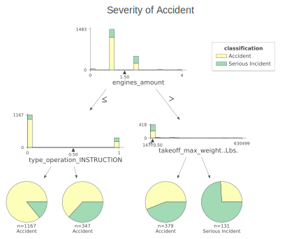

```

When the `engines_amount` is greater than 1.5 and the `takeoff_max_weight..Lbs.` is larger than 14770.5, the accident will be more likely to be severe.

```{r cv, fig.cap="Cross validation for the optimal depth of decision tree", echo=FALSE, out.width="50%"}

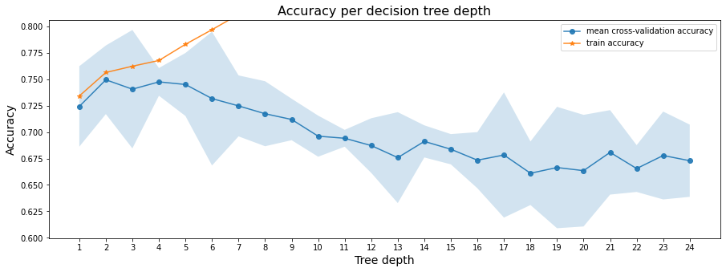

```

By performing cross validation, we find the depth-2 tree achieves the best mean cross-validation accuracy 74.94988 +/- 1.62372%.

### Logistic Regression

```{r, echo = FALSE}
knitr::include_url("incident_raw_logistic_result.html", height = "500px")
```

Logistic regression shows that the increases in `engines amount`, `occurrence year`, `registration category EXT`, `registration category PIN`, `registration category PRI`, `registration category TPR`, `operation phase RUN AFTER LANDING` or `fu PA` will increase the log odds of getting severe incident, while increases in `engine type PISTON`, `operation phase FINAL APPROXIMATION`, `operation phase MANEUVER` or `operation phase Others` will decrease the log odds of getting severe incident [@yc1].

### Assumption Checking

#### 1. Linearity

```{r linear, fig.cap="Check linearity assumption for logistic regression", echo=FALSE, , out.width="100%"}

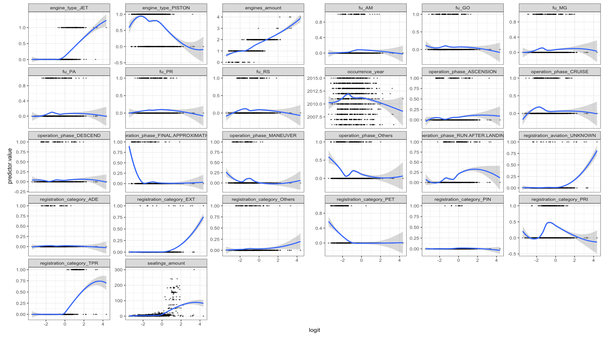

```

As shown, most of variables has linearity, except that `registration_category_PRI` and `registration_phase_RUN_AFTER_LANDING` seem to be poor at linearity and might require further data transformation.


#### 2. No Multicollinearity
```{r, echo = FALSE, results='asis', warning=FALSE, message = FALSE}
load("assumption.RData")
library(stargazer)
test<- t(myvif %>% data.frame() %>% mutate(across(where(is.numeric), ~ round(., 2))))
stargazer(test, type = "html",flip=TRUE, title = "Table 5: VIF value for each variable")
```

To satisfy collinearity assumption, we make sure all VIF value are less than 10 in Table 5. We manually removed the variables with VIFs greater than 10 [@yc2].


#### 3. No Influential Observations

Here are the VIF values for each variable.

```{r, outliner, fig.cap = "Check no influential observations assumption for logistic regression", echo = FALSE}
library(broom)
plot(mylogit, which = 4, id.n = 3)
```

In the Cook's distance plot, outliers in the dataset are presented and the 3 largest distance values are labelled which require us to further explore them.


```{r, echo = FALSE}
model.data <- augment(mylogit) %>% 
  mutate(index = 1:n()) 
model.data %>% top_n(3, .cooksd)
```

The three most extreme observations are shown as above.


```{r,extreme, fig.cap = "Plot out the standard residuals", echo = FALSE}
ggplot(model.data, aes(index, .std.resid)) + 
  geom_point(aes(color = classification), alpha = .5) +
  theme_bw()
```

To filter outliners, we try searching for the points with absolute value of standard residual to be greater than 3, we find no such points in our dataset hence there is no influential observations.

#### 4. Independence of observations

We can assume this assumption is satisfied because each observation is an individual airplane crash accident.


### Attempting on Clustering
We would like to perform DBSCAN or Kmeans clustering on our dataset. However, we have 84 columns in our current dataset and so it is necessary to reduce the dimensions first.

```{r pca, fig.cap="Principal component analysis on the dataset", echo=FALSE, out.width="50%"}

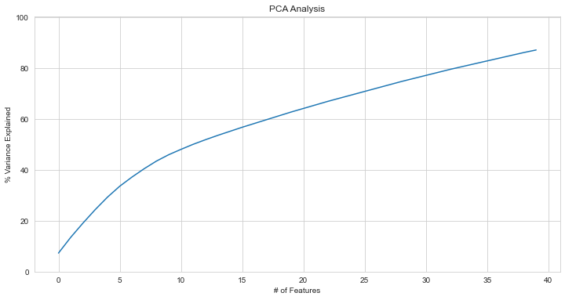

```


The result of PCA shows that when we keep 7 dimensions, only around 40% of variance will be captured and the curse of dimensionality might still exist. Hence it is not sensible to continue the investigation by performing clustering. Also, the DBSCAN does not give a good result on it hence not included.


## Conclusion

By visualizing the accidents on a map, we found that there is a concentration of accidents in the state of São Paulo, or more generally in the whole Southeast Region of Brazil. The possible explanations are linked to demography or the high density of air traffic. As air activity is higher in these areas, the risk of an accident to occur increases. 

Then, We employed linear, logistic and quantile regression to investigate the association between aircraft lifetime, accident severity and damage level, but did not find any statistically significant associations. We also did an analysis on the different features of the aircraft. Although it is hard to tell that certain type of features are more likely to encounter accidents, we could conclude that most of the accidents come from small aircrafts for private purposes. Moreover, certain features were mostly one of the characteristics of the model of the aircraft, so we can expect for them to be omitted.

Overall, for predicting accident severity, due to a small $R^2$ in logistic regression and a relatively satisfying 75% accuracy from decision tree, we prefer decision tree over logistic regression as our predictive model. By looking at the decision tree, we use `engines_amount` as the major factor and `type_operation_INSTRUCTION` and `takeoff_max_weight..Lbs.` as the secondary factors to predict the severity of accident.

Finally, our analyses and research allowed us to answer our initial questions. We have looked at several potential factors that can increase the risk of accidents, and now have a better understanding of them, especially in Brazil. 

## Future improvements

Currently, we have too many categorical variables in our dataset. Affected by the limit of our machine learning techniques, we mainly used numerical variables while building up predictive models, hence we have to transform those categorical variables into numerical ones by adding lots of dummy variables. However, after transformation, the dimension becomes extremely large. We would like to perform clustering but we have to reduce the dimension first. However, the result of PCA shows that we cannot use this technique to reduce the dimension sufficiently and still make sure it contains most of the information in the dataset. Hence we require a larger dataset with more observations. Currently we are using Brazilian Aeronautics Accidents in 10 years. So it is possible to enlarge our dataset by expanding our investigation to a longer period as well as study more countries.


