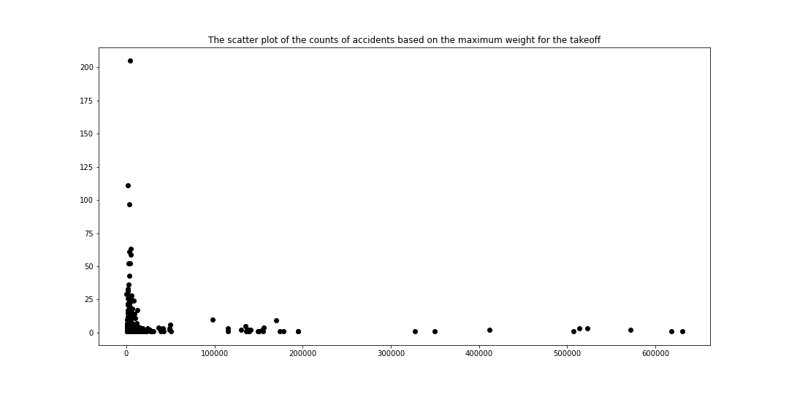

<div style="text-align: justify">
<div style="text-justify: inter-word">

```{r setup, include=FALSE}
knitr::opts_chunk$set(echo = TRUE)
options(knitr.duplicate.label = "allow")
```

## Introduction

Modern society has been become increasingly dependent on the use of airplanes during the past decades. Despite the impressive engineering feat that aviation represents, airplanes and other aircraft sometimes fail, occasionally fatally. Understanding the causes of failure and considering what can be done to address these is of crucial interest for regulatory bodies and aviation authorities, but also for passengers. In the following dataset, we consider an extensive collection of incidents involving aircraft of different types across Brazil in the period of time 2006-2015. Various data have been collected for each incident. In what follows, we set out to investigate common features of these aircraft incidents.

### Research questions

The main issue is to understand the factors that favor a plane crash, especially in Brazil in a 10-year period. Similarities between the accidents will be sought. Perhaps would it be possible to identify risk factors thereby improving passenger safety? 

Here are some more specific questions arising from the main problem that we will try to answer: 

- How are the accidents distributed on a map? Are there areas where accidents are more concentrated? 

- How do the accidents evolve through time? Is the occurrence rate constant? Are there periods with more accidents, i.e. during school vacation, summer? Do they happen at a certain time of the day?

- Does the age of the aircraft play a role? Are old planes more prone to accidents? 

- What are the main occurrence types or causes of accidents? 

- What about the characteristics of the aircraft? Do certain features of the aircraft have an influence on the occurrences?

- What are the causes of severe incidents?

### Approaches

- We represented accidents by state in Brazil in order to visualize their distribution. To go deeper, we used some $\textsf{R}$ packages for geocoding (the data having only the name of the places, but not the geographical coordinates) in order to represent each accident on a map.  

- We employed linear, logistic and quantile regression to investigate the association between aircraft lifetime, accident severity and damage level.

- We made pie charts to see the shares between each categories of each features. Also, we checked if some columns were highly correlated to each other.

- After transforming categorical data to numerical data by getting dummy variables, we performed decision tree and logistic regression to find a good prediction of the accident severity.

## Sources of information / datasets

The dataset used in this report is from  [Kaggle](https://www.kaggle.com/paulovasconcellos/aeronautics-accidents-in-brazil) provided by the CENIPA (Centro de Investigação e Prevenção de Acidentes aeronáuticos, [Brazilian Open Data](https://dados.gov.br/dataset/ocorrencias-aeronauticas-da-aviacao-civil-brasileira)). The given dataset contains two files (`aircrafts.csv' and `occurrences.csv'), but merging them based on the unique occurrence ID ($occurrence\_id$) for each aircrafts was possible, so the latter one (`aircrafts_occurrences_merged.csv') was used to analyse the different occurrences from the aircrafts. 

The file contains different information about the aircraft and the accident. First of all, the dataset contains several columns about the features of the aircrafts which encountered accidents:

* $aircraft_id$ - Aircraft's identification number
* $registration$ - Aircraft's registration number
* $operator\_id$ - Operator's identification number
* $equipment$ - Type of the aircraft (Airplane, Helicopter, Glider, Ultralight, Amphibious, Airship). Some of them are unknown.
* $manufacturer$ - Name of the manufacturer of the aircraft
* $model$ - Name of the model of the aircraft
* $engine\_type$ - Type of the engine
* $engines\_amount$ - Amount of the engine (it goes from 0 to 4)
* $takeoff\_max\_weight (Lbs)$ - Maximum weight that the aircraft can hold for the takeoff
* $seatings\_amount$ - Number of available seats of the aircraft
* $year\_manufacture$ - Year when the aircraft was built
* $registration\_country$ - Country in which the aircraft was registered (mostly Brazil, but also some other neighboring countries)
* $registration\_category$ - Aircraft's registration category at the moment of the occurrence
* $registration\_aviation$ - Aircraft's aviation category at the moment of the occurrence
* $origin\_flight$ - Location of the departure of the flight.
* $destination\_flight$ - Planned destination of the flight.
* $operation\_phase$ - Operation phase at the moment of the occurrence
* $type\_operation$ - Type of operation at the moment of the occurrence
* $damage\_level$ - Level of damage of the aircraft, there are four levels (None, Light, Substantial, Destroyed). Some of them are unknown.
* $fatalities\_amount$ - Number of fatalities from the accident. 
* $extraction\_day$ - Date when the data was collected.

Then, the dataset also contains columns about the occurrences: 
* $classification$ - Degree of seriousness of the accident (serious incident or accident)
* $type\;of\;occurrence$ - Type of accident 
* $localization$ - City where the occurrence happened
* $fu$ - State where the occurrence happened
* $country$ - Country where the occurrence happened (mostly Brazil, but also some other neighboring countries)
* $aerodrome$ - Aerodrome's ICOA code
* $occurrence\_day$ - Occurrence date
* $time$ - Time of the occurrence (UTC)
* $under\_investigation$ - If the accident is or went under investigation (Yes, no or unknown)
* $investigating\_command$ - Investigation command responsible for the occurrence investigation
* $investigation\_status$ - Status of the investigation
* $report\_number$ - Final report's identification number
* $published\_report$ - If the report was published (If yes, 1)
* $publication\_day$ - Publication day of the report
* $recommendation\_amount$ - Security recommendation quantity emitted
* $aircrafts\_involved$ - Quantity of aircrafts involved in the occurrence
* $takeoff$ - 
* $extraction_day$ - the date when the data was collected.


````{r packages, include=FALSE}
library(ggplot2)
library(geobr)
library(tidyr)
library(dplyr)
library(corrplot)
library(stargazer)
library(cowplot)
library(snakecase)
library(stringi)
library(stringr)
library(leaflet)
library(readr)
library(quantreg)
library(latex2exp)
library(lubridate)
````

```{r,include=FALSE}
tex2markdown <- function(texstring) {
  writeLines(text = texstring,
             con = myfile <- tempfile(fileext = ".tex"))
  texfile <- pandoc(input = myfile, format = "html")
  cat(readLines(texfile), sep = "\n")
  unlink(c(myfile, texfile))}
```


## Exploratory data analysis
```{r, include=FALSE}
# loading the data
#data=read.csv("~/Desktop/Github/SCV/SCV_project/MATH517team2-4/MATH517team2-4/Data/aircrafts_occurrences_merged.csv")
data = read.csv("../Data/aircrafts_occurrences_merged.csv")
```

```{r,include=FALSE}
#dealing with the NA
na_count <-sapply(data, function(y) sum(length(which(is.na(y)))))
na_count
```

```{r,include=FALSE}
data_wo_na=drop_na(data)
```

```{r ,  results='asis', echo=FALSE}
stargazer(na_count, flip=TRUE, type = "html", title = "Table 1: Repartition of NAs in the columns")
```

The dataset is full of missing values to the point where there is no complete row. The Table 1 displays the number of missing values in each column. $Takeoff$ is the top column containing NAs, with more than 87.4% of the data missing. We see also a significant number of missing data points in the columns related to the report such as $report_number$ with more than 78.6%, $published_report$,$publication_day$ and $publication_Week$ with 51%. We can see that the data is most present for columns containing information that are independent of the accident such as $aircraft_id$, $manufacturer$ and $type_operation$.

```{r, include=FALSE}
table(data["equipment"])/(2043-1)
```

When looking at the type of equipment, 78% of our data concerns airplanes. It is followed by helicopter that constitue a little less that 13% of the data. Then comes ultralight, a bit more than 7% of the dataset. The rest are airship, amphibious our unknown.

```{r, include=FALSE}
unique(data["manufacturer"])
```
```{r, include=FALSE}
table(data["manufacturer"])
```
There are 120 unique manufacturers represented in our dataset. The top three manufacturers are the following: $NEIVA INDUSTRIA AERONAUTICA, EMBRAER and AERO BOERO$ with respectively 388, 155 and 126 planes. 

```{r, include=FALSE}
table(data$engine_type)/2043
```
78% of the planes present in the dataset use a $ PISTON$ engine. 7% use $TURBOSHAF$ engine, 6.8% use $TURBOPROP$ and the rest $JET$, $WITHOUT TRACTION$ or unknown engines.

```{r NbrEng, fig.cap="Distribution of the number of engines",echo=FALSE}
hist(data$engines_amount,main="Distribution of the number of engines.", xlab="Number of engines")

```

```{r,include=FALSE}
table(data$engines_amount)/(2043-9)
```
Considering Figure \@ref(fig:NbrEng), 73.25% of planes use a single engine. 24% of planes use two engines. The rest of planes have either 3 or 4 engines. We believe that 0 refers to unknown data although there was no mention of it in the data description.


```{r distWeight,fig.cap="Distribution of take off max weight (in Lbs)", echo=FALSE}
data_weight_no_zero=data
data_weight_no_zero=data_weight_no_zero[data_weight_no_zero$takeoff_max_weight..Lbs. != 0,]
hist(data_weight_no_zero$takeoff_max_weight..Lbs., main="Distribution of take off max weight (in Lbs)", xlab='Lbs', breaks =50)
```
```{r,include=FALSE}
max(data_weight_no_zero$takeoff_max_weight..Lbs.)
```
Figure \@ref(fig:distWeight) is displayed the distribution of take off max weight (in Lbs). It can be seen that that the mean weight is of 11,919.2 Lbs (5,406.4 Kg). There are though very strong outliers with planes having set their maximun weight at 630,499 Lbs (285,989.5 Kg). 

```{r distManYear,fig.cap="Distribution of manufacturing year",echo=FALSE}
data_year_no_zero=data
data_year_no_zero=data_year_no_zero[data_year_no_zero$year_manufacture != 0,]
hist(data_year_no_zero$year_manufacture,breaks=100, main="Distribution of manufacturing year", xlab="Year")
```
In Figure \@ref(fig:distManYear) is displayed the distribution of manufacturing year. One can observe that the planes represented in the dataset were manufactered between 1936 and 2015. The year distribution is trimodal with high peaks in late 70s, early 90s and mid 00s. 

```{r, include= FALSE}
table(data$registration_country)
```

Concerning the registration country, 2000 out of the 2043 constituting the data are registered in Brazil. 22 are registered in the United States of America and finally there is one accident registered in Germany, France, Poland, Russia, Saudia Arabia, South Africa, Spain and Uruguay. 

```{r, include= FALSE}
table(data$registration_aviation)/(2043)
```
37% of the accident concern $private$ registrations. 18% come from $instruction$ registration. The rest are either $aerotaxi$ (13%),$experimental$ (9.8%), $agricultural$ (9%), $regular$ (4%), $specialized$ (3%) or other registrations. 


```{r, include= FALSE}
sort(table(data$operation_phase)/2043)
```
19% of the accidents registered happened when landing. 17% when taking off. 11% when cruising and 9% during the run after the landing. Accidents also happen during the following phases: during maneuver (4.9%), during ascension(4.8%), final approximation (3.4%), descend (3.3%), low altitude navigation (2.8%), traffic circuit (2.5%), taxi (2%), rush on the ground (1.4%) and other less represented phases.

```{r, include= FALSE}
sort(table(data$damage_level)/2043)
```
```{r, include= FALSE}
table(data$classification)/2043
```
Concerning the damage, 72.6% of crashes were classified as $accident$ and the rest was classified as $serious incident$. 58% of the planes knew substantial damage after the crash. 17% are completely destroyed, 12.7% know light damage where 8% have no damage. The rest is unknown. 


```{r distFat,fig.cap="Distribution of fatalities",echo=FALSE}
hist(data$fatalities_amount, breaks=50, main= "Distribution of fatalities", xlab="fatalities")
```
In Figure \@ref(fig:distFat) is displayed the number the fatalities. It can be seen that most of the crashes involve less than 20 deaths. The deadliest crash was in a private helicopter in 1999 in Sau Paolo where 199 lost their life during the landing. 


```{r, include=FALSE}
table(data$investigation_status)/2043
```
Finally, the investigation of 52% of the crashes is finished. 37% are in progress and less than 0.05% of the crashes have had their investigation reopened. 

## Geographical visualization of accidents 

```{r, include=FALSE}

data = read.csv("../Data/aircrafts_occurrences_merged.csv")

# Select needed variables
data = data[, c("localization", "fu", "country", "aerodrome", "origin_flight", 
                "destination_flight", "registration_country", "classification", 
                "registration", "manufacturer", "model", "operation_phase", 
                "damage_level", "type.of.occurrence", "occurrence_day", "time")]

# Formatting
data$classification = tolower(data$classification)
data$manufacturer[data$manufacturer == "***"] = "unknown"
data$model[data$model == "***"] = "unknown"
data$operation_phase = tolower(data$operation_phase)
data$operation_phase[data$operation_phase == ""]  = "unknown"
data$damage_level = tolower(data$damage_level)
data$type.of.occurrence = tolower(data$type.of.occurrence)


#### Accidents per state ####

# Brazil states
brazil_fu = data[data$fu != "***" & data$fu != "EX",]

# Accidents per state
brazil_fu = data.frame(table(brazil_fu$fu))
colnames(brazil_fu) = c("fu", "accidents")

# Brazilian states
#states <- read_state(year=2019)
states <- readRDS("states.rds")

# Join the databases
states <- dplyr::left_join(states, brazil_fu, by = c("abbrev_state" = "fu"))
states$accidents[is.na(states$accidents)] = 0

# Map
labels <- sprintf(
  "<strong>%s</strong><br/>%g accidents",
  states$name_state, states$accidents
) %>% lapply(htmltools::HTML)

bins <- seq(0,500,100)
pal <- colorBin("YlOrRd", domain = states$accidents, bins = bins)

fu <- leaflet(states) %>% addTiles() %>% addPolygons(
  fillColor = ~pal(accidents),
  weight = 1,
  opacity = 1,
  color = "grey",
  dashArray = "3",
  fillOpacity = 0.4, 
  layerId = ~geom,
  highlightOptions = highlightOptions(
    weight = 3,
    color = "#666",
    dashArray = "",
    fillOpacity = 0.6,
    bringToFront = TRUE),
  label = labels,
  labelOptions = labelOptions(
    style = list("font-weight" = "normal", padding = "3px 8px"),
    textsize = "15px",
    direction = "auto")) %>%
  addLegend(pal = pal, values = ~accidents, opacity = 0.7, title = "Accidents",
            position = "bottomright")

# External accidents + NAs
external = t(data.frame(table(data[data$fu == "***" | data$fu == "EX", "country"])))
rownames(external) = c("Countries", "Accidents")
#stargazer(external)

# Preparing data before geolocating
brazil = data[data$fu != "***" & data$fu != "EX" & data$localization != "NÃO IDENTIFICADA",]

# Loading coordinates
table = readRDS(file = "localization.rds")

# Adding location
brazil$localization = to_title_case(brazil$localization)
n = length(brazil$localization)
loc = 0

for (i in 1:n) {
  loc = rbind(loc, table[table$names==brazil$localization[i], c("lon", "lat")])
}

brazil = cbind(brazil, loc[-1,])

# Label + popup
label <- sprintf("%s<br/>%s<br/>%s<br/>%s",
                  brazil$model,
                  brazil$classification,
                  brazil$occurrence_day,
                  brazil$localization
                  ) %>% lapply(htmltools::HTML)

popup <- paste(sep = "<br/>", 
               paste("Model:", brazil$model),
               paste("Manufacturer:", brazil$manufacturer),
               paste("Registration:", brazil$registration),
               paste("Classification:", brazil$classification),
               paste("Damage level:", brazil$damage_level),
               paste("Operation phase:", brazil$operation_phase),
               paste("Type of occurrence:", brazil$type.of.occurrence),
               paste("Occurrence date:", brazil$occurrence_day),
               paste("Occurrence time:", brazil$time)
               )

# Map
cluster <- leaflet(data = brazil) %>% addTiles() %>% 
  addMarkers(~lon, ~lat, popup = popup, label = label, clusterOptions = markerClusterOptions())

# Cities with most accidents
cities = t(data.frame(sort(table(brazil$localization), decreasing = TRUE)[1:10]))
rownames(cities) = c("Cities", "Accidents")
#stargazer(cities)

```

This section is devoted to the study of the places where aircraft accidents occur. Indeed, it is essential to understand this in order to identify more risk factors.

First, a comparison between the Brazilian states allows us to draw a first conclusion (Figure \@ref(fig:states)). Note that accidents are cumulative over the 10-year period. 

```{r states, fig.cap="Number of accidents from 2006 to 2015 by state in Brazil", echo=FALSE}

fu

```

All the states have less than 200 accidents, more precisely less than 170 (Rio Grande do Sul), except one state: São Paulo. This state is not larger than the others (it is rather medium in size), which indicates that there is clearly a concentration of accidents in this area. Note that ten accidents are not shown on the map (Table 2). Eight of them occurred outside of Brazil and two more for other reasons: one ended up in international waters and the other does not have its location identified. 

```{r , results='asis', echo=FALSE}

stargazer(external, type = "html", title = "Table 2: Accidents not reprensented on the previous map by country")

```

An explanation for this observation is linked in particular to demography. Indeed, the state of São Paulo is the most populous in Brazil with more than 41 million inhabitants in 2010 [@population]. This represents more than 20% of the total population of the country. Air traffic is therefore concentrated there, especially since the largest airports of the country are located in this state (for example São Paulo Guarulhos International Airport and São Paulo Congonhas Airport). The risk of accidents is therefore higher. 

To be more precise in the geographical approach, it is possible to establish a map according to the location of the accident (nearest city). As the geographic coordinates are not included in the data, it is possible to use geocoding given that the city is available. For this, we used two packages: `ggmap` and `Nominatim`. An API key is required to geocode for each package ([Google Maps](https://mapsplatform.google.com) for `ggmap` and [MapQuest](https://developer.mapquest.com) for `Nominatim`). As the locations are quite precise, there are often errors in the coordinates returned by geocoding, which is why we used two packages by selecting the most reasonable coordinates. It is still possible to have some deviations between the city and the place shown on the map, but the latter should not be greater than a degree of longitude and latitude. 

In Figure \@ref(fig:location), accidents are represented in clusters which are scattered by zooming. For each accident, information is available such as the model, the manufacturer, the date or the time. Note that 11 more accidents have been removed compared to the last map. The reason is that the location has not been identified. 

```{r location, fig.cap="Number of accidents from 2006 to 2015 clustered by location in Brazil", echo=FALSE}

cluster

```

We still notice the same thing, that is to say a concentration of accidents in the Southeast Region of Brazil. This is explained by the fact that the traffic there is the most dense, as this article confirms in particular [@airtraffic]. It turns out that some cities are noteworthy in terms of the number of accidents. Table 3 represents the ten cities with the most accidents. 

```{r, results='asis', echo=FALSE}

stargazer(cities, type = "html", title = "Table 3: Top ten cities with the highest number of accidents")

```

A demographic explanation is still reasonable. The first six cities in Table 3 are among the ten most populous cities in Brazil [@cities]. Moreover, they also have airports on the list of the 20 busiest airports in Brazil [@airports]. 

Looking more closely at the accidents in these cities, we see that all kinds of aircraft are represented, whether they are airliners, tourist planes or even helicopters. To learn more in this direction, it is possible to further explore the accidents on the map (Figure \@ref(fig:location)). 


## Time analysis

### Visualization
```{r, include=FALSE}
data = read_csv("../Data/aircrafts_occurrences_merged.csv") 

data$occuranceWeek <- as.Date(data$occurrence_day)
data$occuranceWeek <-wday(data$occuranceWeek, label=TRUE)

data$publicationWeek <- as.Date(data$publication_day)
data$publicationWeek <-wday(data$publicationWeek, label=TRUE)
```

```{r, include=FALSE}
data$occuranceWeek <- as.Date(data$occurrence_day)
```

```{r hourAccid, fig.cap="Distribution of Accidents throughout the hours of the day", echo=FALSE}
hist(strptime(data$time, format="%H:%M:%S"),main="Distribution of Accidents throughout the hours of the day",xlab="Hours of the day",breaks="hours")
```
In Figure \@ref(fig:hourAccid) are displayed the distribution of accidents throughout the hours of the day. The distribution is bimodal and it can be observed that most of the crashes happen either 2pm or 8pm.

```{r timeAccid, fig.cap="Distribution of Accidents throughout days",  echo=FALSE}
hist(data$occurrence_day,main="Distribution of Accidents throughout days",xlab="Days",breaks='months')
```
In Figure \@ref(fig:timeAccid) are displayed the distribution of accidents throughout days. we can see that there is an increasing trend. 

```{r, include=FALSE}
Time_Occurence_publication=data$publication_day-data$occurrence_day
Time_Occurence_publication=as.numeric(Time_Occurence_publication, units="days")
```

```{r Occurancepublication, fig.cap="of time difference between the occurance and the publication date",echo=FALSE}
hist(Time_Occurence_publication,main="Distribution of time difference: occurance and publication",xlab="Number of days")
```
In Figure \@ref(fig:Occurancepublication) are displayed the distribution of time difference in days between the occurance day and publication day. It can be seen that most of crashes are reported the same year. The longest time difference is of 3589 days. It was for a political operation caused by a loss of control in the air in year 1986 in Brazil. 

### Lifetime of aircraft

```{r include=FALSE}
df.age <- read_csv("../Data/aircrafts_occurrences_merged.csv")
```

In this section, we consider whether there is any association between the age of an aircraft and the severity and damage level of the incident. To begin, we have plotted the cumulative distribution function of the aircrafts' age in Figure \@ref(fig:ageCDF) below.

```{r echo=FALSE}
# Setting categorical variables to factors and removing missing values

# Removing rows with missing or 0 value for the year of manufacture
df.age<-df.age[df.age$year_manufacture!=0 & !is.na(df.age$year_manufacture),]

# Extracting the year of occurrence
df.age$occurrence_day<-as.numeric(format(df.age$occurrence_day, format="%Y"))

df.age$lifetime<-df.age$occurrence_day-df.age$year_manufacture


# Plotting cumulative distribution functions
# plot(ecdf(df.age$occurrence_day))
# plot(ecdf(df.age$year_manufacture))


# First, we assign a numerical value to each damage level, and remove rows with unknown damage level

df.damage.age<-df.age[df.age$damage_level!='UNKNOWN',]
df.damage.age$damage_level[df.damage.age$damage_level=='NONE']<-0
df.damage.age$damage_level[df.damage.age$damage_level=='LIGHT']<-1
df.damage.age$damage_level[df.damage.age$damage_level=='SUBSTANTIAL']<-2
df.damage.age$damage_level[df.damage.age$damage_level=='DESTROYED']<-3
df.damage.age$damage_level<-as.numeric(df.damage.age$damage_level)

# Assign values 0 to incidents classified as 'accident', and 1 to incidents classified as serious incident
df.damage.age$classification[df.damage.age$classification=='ACCIDENT']<-0
df.damage.age$classification[df.damage.age$classification=="SERIOUS INCIDENT"]<-1
df.damage.age$classification<-as.numeric(df.damage.age$classification)

# Set aircraft type as factor, and remove NA rows
df.damage.age$equipment<-as.factor(df.damage.age$equipment)
df.damage.age<-df.damage.age[!is.na(df.damage.age$equipment),]
```

```{r ageCDF, fig.cap="Cumulative distribution function of the aircraft's lifetime, denoted by $X$", echo=FALSE}
plot( ecdf(df.age$lifetime), main='', ylab =TeX('$P(X \\leq x)$') )
```

We observe that more than 80% of the aircraft are between 0 and 40 years old at the time of the incident, with a small number of aircraft reaching nearly 80 years.

Next, we provide a scatter plot to visually inspect the association between age and damage level in (\@ref(fig:damagelifetime))

```{r damagelifetime, fig.cap="Scatter plot of damage level (coded on a 0-3 scale) versus aircraft lifetime in recorded incidents", echo=FALSE}
plot(df.damage.age$lifetime, df.damage.age$damage_level, 'p', xlab='Aircraft lifetime',ylab='Damage level')
```

and likewise between aircraft lifetime damage level (outcome)  in (\@ref(fig:damageseverity))

```{r damageseverity, fig.cap="Scatter plot of severity versus aircraft lifetime in recorded incidents", echo=FALSE}
plot(df.damage.age$lifetime, df.damage.age$classification, 'p', xlab='Aircraft lifetime', ylab='accident severity')
```

To investigate the marginal association between age and damage level we perform regression analysis using a linear model, logistic model in addition to quantile regression. 

The fit diagnostic for the linear regression of damage level on lifetime of the plane gives

```{r echo=FALSE}
fit.linear<-lm(df.damage.age$damage_level ~ df.damage.age$lifetime)
summary(fit.linear)
```

Here, we have coded the damage level on a scale of 0 to 3. Furthermore, the confidence interval is given by

```{r echo=FALSE}
cbind(beta = coef(fit.linear), confint(fit.linear))
```

which is small and includes the null value of the slope. 

Likewise, the logistic regression of aircraft lifetime on severity (with corresponding confidence intervals) is given below:

```{r echo=FALSE}
fit.logistic <-glm(classification ~ lifetime, data = df.damage.age, family = "binomial")
summary(fit.logistic)
exp(coef(fit.logistic))
exp(cbind(OR = coef(fit.logistic), confint(fit.logistic)))
```

Once again, the confidence interval includes the null value. Finally, we consider the quantile regression coefficient from the quantile regression model
$$ Q_Y(\tau\mid X) = a_0(\tau) + b_0(\tau)X $$
where the outcome $Y$ is airplane lifetime and we take accident severity as an exposure $X$. The resulting regression coefficient is plotted in Figure (\@ref(fig:quantilelifetime))

```{r quantilelifetime, fig.cap="Quantile regression of damage level on the quantile of aircraft lifetime", echo=FALSE}
# Quantile regression for severity
fm2 <- rq(lifetime ~ classification, data = df.damage.age, tau =  0.1+ 1:8/10)
plot(fm2, parm = 2, mar = c(5.1, 4.1, 2.1, 2.1), xlab=TeX('$\\tau$'),main='Y = Lifetime, X = Damage level', ylab = TeX('$b_0(\\tau$)'), cex = 1, pch = 19)
```

The quantile plot shows that the conditional cumulative distribution function, conditioning on severity level 'serious incident', is narrower compared to the conditional cumulative distribution function, conditioning on severity level 'accident'. In other words, both high and low quantiles are shifted towards the median.

As we did not find any strong associations between damage level and age of the aircraft marginally in the population. This motivated us to examine further whether such associations could exist within subsets of the population, such as the strata of incidents involving helicopters. Once again, we perform a logistic regression, which yields the following fit diagnostic and confidence intervals:

```{r echo=FALSE}
df.helicopters<-df.damage.age[df.equipment='HELICOPTER',]
fit.logistic <-glm(classification ~ lifetime, data = df.helicopters, family = "binomial")
summary(fit.logistic)
exp(coef(fit.logistic))
exp(cbind(OR = coef(fit.logistic), confint(fit.logistic)))
```

We do not find a strong association between accident severity and aircraft age within the stratum of helicopters either (the confidence interval for the lifetime coefficient includes the null-value, and the p-value of the coefficient is 0.227).

## Features of the aircrafts

### Occurence type

### Other features

Different features of aircrafts are presented in the dataset, and some types of them might have caused the most accidents among all. An interactive plot ([link](https://aircraftaccteam2.herokuapp.com)) involving pie charts of the number of counts of different features is made to compare and determine which types of features have the most occurrences. The columns $equipment$, $manufacturer$, $model$, $engine_type$, $engines_amount$, $registration_aviation$, $operation_phase$, $type_operation$. 

```{r equip, fig.cap="The shares of accidents coming from the same type of aircraft", echo=FALSE}


```

```{r manu, fig.cap="The shares of accidents coming from the same manufacturer", echo=FALSE}

include_graphics("2.png")

```

```{r model, fig.cap="The shares of accidents coming from the same aircraft model", echo=FALSE}


```

```{r engtyp, fig.cap="The shares of accidents coming from the same type of aircraft engine", echo=FALSE}


```

```{r engamo, fig.cap="The shares of accidents coming from the same amount of engine", echo=FALSE}


```

```{r regav, fig.cap="The shares of accidents coming from the same registration of aviation ", echo=FALSE}


```

```{r opphase, fig.cap="The shares of accidents coming from the same operation phase", echo=FALSE}


```

```{r typop, fig.cap="The shares of accidents coming from the same type of operation", echo=FALSE}


```

Figure \@ref(fig:equip) to Figure \@ref(fig:typop) are the pie charts of the shares of different features of the aircrafts. First, certain features have a dominating one, such as the one for the type of aircraft from Figure \@ref(fig:equip) (Airplane), the one for the type of engine from Figure \@ref(fig:engtyp) (Piston), and the one for the amount of engine from Figure \@ref(fig:engamo) (1). Then there are also certain features that are more shared by different categories, but the main one is still apparent, such as the one for the aviation registration from Figure \@ref(fig:regav) (Private) and the one for the type of operation from Figure \@ref(fig:optyp) (Private). Last, some are shared by several categories, such as the one for the operation phase from Figure \@ref(fig:opphase) having Landing and Takeoff as the type phases in which the accidents occurred the most. The one for the manufacturer and the model (Figure \@ref(fig:manu) and Figure \@ref(fig:model)) are shared by multiple types of them, but we can observe that the share of the manufacturers are spread more or less equally for only certain of them, whereas the one of the model is shared more or less equally for almost all of them. We have a more dense share for the model: if we except the ones that have less than 20 counts, the amount would sum up to almost 60\%.

Although there are certain types of aircraft features that encountered the most accidents, we cannot say much if they are more likely to encounter accidents than others, since we don't know the percentage among all the flights. It is highly possible that the main ones are also the most used ones, and the percentage of occurrences might not be bigger than the other ones. Therefore it is hard to conclude that the choice of certain features can be more dangerous to the passengers or not. We can still say that the most dangerous operation phase is when the aircraft is landing or taking off, since all the aircrafts go through all the phases during the operation. 

The correlation between the different features is interesting to observe, since we can omit certain columns to analyse the type of the features of aircrafts that encountered the most accidents. However there are some subtleties in analyzing the correlation because the variables are categorical. As most of the variables are not ordered, several columns suspected to be correlated are chosen. 

The aim is to see if between the two chosen columns, one is a further classification of the other one. For instance, we want to check if aircrafts of the same model are from the same manufacturer. In other words, we want to check if the column $model$ is a further classification of the column $manufacturer$. Mainly, we want to check if the aircraft models have a certain type of fixed features, because if they are, those features can be omitted and the information about the model is enough for the analysis.

To check, let A and B the columns. Then the count of categories of A is counted for each categories of B, and the sum of the number of outliers (all counts except the largest count from A) is computed. We made several hypotheses and checked if they were correct: 

* Are the aircrafts from the same model belonging to the same type of aircraft?
* Do the aircrafts from the same model come from the same manufacturers?
* Do the aircrafts from the same model have the same maximum weight for the takeoff?
* Do the aircrafts from the same model have the same number of available seatings?
* Do the aircrafts from the same model have the same number of engines?
* Do the aircrafts from the same model have the same type of engines?
* Do the aircrafts from the same model registered as to have the same purpose?


```{r , results='asis', echo=FALSE}
A=c("equipment", "manufacturer","takeoff_max_weight (Lbs)", "seatings_amount", "engines_amount", "engine_type","registration_aviation")
B=c("model","model","model","model","model","model","model")
Number_of_outliers=c(7,92,173,211,5,8,392)
corr=data.frame(A,B,Number_of_outliers)

stargazer(corr, type = "html", title = "Table 4: the pair of columns chosen and its number of outliers")

```

Table 4 shows the number of outliers computed from each pairs of columns. We can observe that on one hand, there are several columns that are indeed highly correlated to the model, such as the type of aircraft, the amount of engines and the type of engines. On the other hand, there are columns that do not often match with the one of the model: the $registration_aviation$ has the most outliers among all. We can conclude that although some columns can be omitted, the others are still important to consider. For instance, for $registration_aviation$, almost 20\% of the cases are outliers, for $takeoff_max_weight (Lbs)$ and $seatings_amount$ about 10\% are outliers, and for $manufacturer$ about 5\% are outliers. We can see that quite often the aircrafts users changed some features from the original aircraft model. 

The maximum weight for the takeoff and the number of available seats of the aircrafts have also been used for the analysis. The scatter plots are made for the analysis, since we are working with categorical variables that are ordered.

```{r max, fig.cap="The shares of accidents coming from the same type of operation", echo=FALSE}



```

Figure \@ref(fig:max) is a scatter plot of the count of the accidents of each maximum weights. We can observe that the most of the accidents are from the aircrafts having lesser maximum weights. 

```{r seat, fig.cap="The shares of accidents coming from the same type of operation", echo=FALSE}


```

Figure \@ref(fig:seat) is a scatter plot of the count of the accidents of each number of available seatings. Again, we can observe that most of the accidents are from the aircrafts having the least number of available seatings. 

As a result, we cannot conclude on the possibility of occurrences on the features of the aircraft, but the observation made shows that most of the occurrences come from private (from Figure \@ref(fig:regav) and \@ref(fig:optyp)), small (from Figure \@ref(fig:max) and Figure \@ref(fig:seat)) aircrafts.

##### include analysis about the fatalities? or give this part to someone else

## Causes of severe accidents vs minor incident

### Transform Categorical Variables into Numerical Variables
To predict the severe accidents vs minor incident and analyse the possible cause, we get dummy variables for each categorical variable, e.g. when one of the operation types is INSTRUCTION, we create a new column called  `type_operation_INSTRUCTION` and give it 1 if the type is INSTRUCTION, 0 otherwise. 

### Decision Tree
After getting dummies variables, we feed the dataset to our decision tree predictive model and obtain the following result. 


When the `engines_amount` is greater than 1.5 and the `takeoff_max_weight..Lbs.` is larger than 14770.5, the accident will be more likely to be severe.


By performing cross validation, we find the depth-2 tree achieves the best mean cross-validation accuracy 74.94988 +/- 1.62372%.

## Logistic Regression

```{r, echo = FALSE}
knitr::include_url("incident_raw_logistic_result.html", height = "500px")
```

Logistic regression shows that the increases in `engines amount`, `occurrence year`, `registration category EXT`, `registration category PIN`, `registration category PRI`, `registration category TPR`, `operation phase RUN AFTER LANDING` or `fu PA` will increase the log odds of getting severe incident, while increases in `engine type PISTON`, `operation phase FINAL APPROXIMATION`, `operation phase MANEUVER` or `operation phase Others` will decrease the log odds of getting severe incident[@yc1].

### Assumption Checking

#### 1. Linearity


As shown, most of variables has linearity, except that `registration_category_PRI` and `registration_phase_RUN_AFTER_LANDING` seem to be poor at linearity and might require further data transformation.


#### 2. No Multicollinearity
```{r, echo = FALSE}
load("assumption.RData")
myvif
```

To satisfy collinearity assumption, we make sure all VIF value are less than 10. We manually removed the variables with VIFs greater than 10 [@yc2].


#### 3. No Influential Observations

Here are the VIF values for each variable.

```{r, echo = FALSE}
library(broom)
plot(mylogit, which = 4, id.n = 3)
```

In the Cook's distance plot, outliners in the dataset are presented and the 3 largest distance values are labelled which require us to further explore them.


```{r, echo = FALSE}
model.data <- augment(mylogit) %>% 
  mutate(index = 1:n()) 
model.data %>% top_n(3, .cooksd)
```

The 3 most extreme observations are shown as above.


```{r, echo = FALSE}
ggplot(model.data, aes(index, .std.resid)) + 
  geom_point(aes(color = classification), alpha = .5) +
  theme_bw()
```

To filter outliners, we try searching for the points with absolute value of standard residual to be greater than 3, we find no such points in our dataset hence there is no influential observations.

### Attempting on Clustering
We would like to perform DBSCAN or Kmeans clustering on our dataset. However, we have 84 columns in our current dataset and so it is necessary to reduce the dimensions first. 


The result of pca shows that when we keep 7 dimensions, only around 40% of variance will be captured and the curse of dimensionality might still exist. Hence it is not sensible to continue the investigation by performing clustering. Also, the DBSCAN does not give a good result on it hence not included.


## Conclusion

- By visualizing the accidents on a map, we found that there is a concentration of accidents in the state of São Paulo, or more generally in the whole Southeast Region of Brazil. The possible explanations are linked to demography or the high density of air traffic. As air activity is higher in these areas, the risk of an accident to occur increases. 

- We employed linear, logistic and quantile regression to investigate the association between aircraft lifetime, accident severity and damage level, but did not find any statistically significant associations.

- We did an analysis on the different features of the aircraft. Although it is hard to tell that certain type of features are more likely to encounter accidents, we could conclude that most of the accidents come from small aircrafts for private purposes. Also, certain features were mostly one of the characteristics of the model of the aircraft, so we can expect for them to be omitted.

- Overall, for predicting accident severity, due to a small $R^2$ in logistic regression and a relatively satisfying 75% accuracy from decision tree, we prefer decision tree over logistic regression as our predictive model. By looking at the decision tree, we use `engines_amount` as the major factor and `type_operation_INSTRUCTION` and `takeoff_max_weight..Lbs.` as the secondary factors to predict the severity of accident.

## Future improvements

Currently, we have too many categorical variables in our dataset. Affected by the limit of our machine learning techniques, we mainly use numerical variables while building up predictive models, hence we have to transform those categorical variables into numerical ones by adding lots of dummy variables. However, after transformation, the dimension becomes extremely large. We would like to perform clustering but we have to reduce the dimension first. However, the result of PCA shows that we cannot use this technique to reduce the dimension sufficiently and still make sure it contains most of the information in the dataset. Hence we require a larger dataset with more observations. Currently we are using Brazilian Aeronautics Accidents in 10 years. So it is possible to enlarge our dataset by expanding our investigation to a longer period as well as study more countries.


